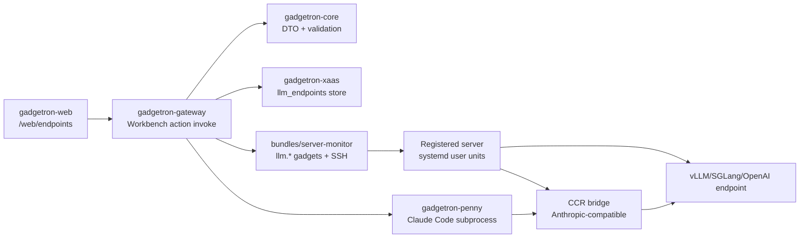

# 18 — LLM Endpoint Deployment Control Plane

> **담당**: @inference-engine-lead, PM (Codex)
> **상태**: Reviewed — implementation in progress
> **작성일**: 2026-05-03
> **최종 업데이트**: 2026-05-03 — CCR target(local/registered server) addendum 반영
> **관련 크레이트**: `gadgetron-core`, `gadgetron-gateway`, `gadgetron-xaas`, `gadgetron-web`, `gadgetron-cli`, `bundles/server-monitor`, `gadgetron-penny`
> **Phase**: [P2B] primary / [P2C] model cache manager + scheduler
> **관련 문서**: `docs/design/phase2/07-bundle-server.md`, `docs/design/phase2/16-server-metrics-timeseries.md`, `docs/design/phase2/17-penny-claude-code-llm-gateway.md`, `docs/design/phase2/12-external-gadget-runtime.md`, `docs/process/01-workflow.md`

---

## 1. 철학 & 컨셉

### 1.1 이 문서가 닫는 공백

Gadgetron 은 이미 서버를 등록하고 관측하는 `server-monitor` 번들을 갖고 있고, Penny 의 Claude Code 모델/gateway 설정도 Admin 에서 바꿀 수 있다. 하지만 운영자가 실제로 원하는 흐름은 아직 끊겨 있다.

1. vLLM/SGLang/OpenAI-compatible endpoint 를 "서버 번들처럼" 등록, 삭제, 상태 확인, 사용 전환한다.
2. endpoint 가 등록 서버 위에 있다면 Gadgetron 이 해당 서버에 접속해 vLLM/SGLang 또는 CCR bridge 를 설치/기동/중지/로그 확인한다.
3. 모델 저장 위치와 cache 위치를 명시해, 원격 서버의 디스크 사용 위치를 운영자가 통제한다.
4. 정상 endpoint 또는 CCR endpoint 를 Penny LLM Gateway 에 붙인다.

이 문서는 사용자가 선택한 **B 범위**를 고정한다. B는 단순 endpoint 목록(A)보다 크고, full GPU scheduler/model catalog(C)보다는 작다.

### 1.2 B 범위 정의

포함한다:

- Endpoint registry: external OpenAI `/v1`, managed vLLM, managed SGLang, managed CCR bridge.
- Endpoint lifecycle: add/list/remove/probe/use.
- Managed host lifecycle: install/start/stop/restart/status/logs for vLLM/SGLang/CCR when the host is already registered in Servers.
- Model storage/cache path: managed runtime launch env 로 `HF_HOME`/engine cache path 를 주입한다.
- Monitoring: `/v1/models`, chat smoke, latency, last error, process status, journal tail, linked host GPU snapshot.
- Penny attachment: healthy CCR/Anthropic-compatible endpoint 를 `agent_brain_settings` 로 연결한다.

제외한다:

- GPU bin packing, automatic placement, multi-node tensor-parallel scheduler.
- Hugging Face catalog browsing/download queue/checksum manager.
- Raw OpenAI `/v1/chat/completions` endpoint 를 Claude Code 에 직접 연결하는 shim.
- UI 에서 임의 shell command 를 입력해 서비스 unit 을 만드는 기능.
- zero-downtime blue/green model serving.

### 1.3 핵심 설계 원칙

1. **Endpoint 는 서버와 다르다.** 서버는 SSH 가능한 host 이고, endpoint 는 LLM protocol surface 다. UI 는 별도 Endpoints 화면을 갖되, managed endpoint 는 registered server 를 참조한다.
2. **v1 은 server-monitor 의 SSH primitive 를 재사용한다.** 새 `llm-endpoints` 번들을 바로 만들면 SSH/inventory 추출 리팩터가 먼저 필요하다. B 구현은 `server-monitor` bundle 에 `llm.*` action 을 추가하고, 추후 shared host connector 가 생기면 독립 bundle 로 분리한다.
3. **Claude Code 에는 CCR/Anthropic bridge 를 붙인다.** vLLM/SGLang 의 OpenAI Chat Completions endpoint 는 Penny 의 일반 provider 후보가 될 수 있지만, Claude Code subprocess 에 직접 붙이지 않는다.
4. **관리자 전용이다.** endpoint 등록 자체는 내부망 SSRF, 비용, 모델 데이터 경계, 원격 설치를 바꾼다. 모든 mutating action 은 `Management` scope 로 제한한다.
5. **시크릿 값은 저장하지 않는다.** API key/token 값은 UI/DB 에 저장하지 않고 env var 이름만 저장한다. 원격 host 에 필요한 secret 은 operator 가 host 환경에 배치하거나, 별도 secret manager phase 에서 다룬다.
6. **자동 설치는 curated profile 만 허용한다.** UI 에 arbitrary install command 를 받지 않는다. vLLM/SGLang/CCR install profile 은 코드에 버전 pin 과 실행 방식이 정의되어 있어야 한다.

### 1.4 현재 실측 사실

2026-05-03 확인 결과, 사용자가 언급한 `10.100.1.5:8000` 은 OpenAI-compatible LLM endpoint 가 아니었다. 동일 서버의 `http://10.100.1.5:8100` 은 `/v1/models` 와 `/v1/chat/completions` smoke test 가 성공했고, model id 는 `cyankiwi/gemma-4-31B-it-AWQ-4bit` 이다.

이 설계의 첫 번째 real-world smoke 대상은 다음 external endpoint 다.

```toml
[providers.gemma4]
type = "vllm"
endpoint = "http://10.100.1.5:8100"
```

Penny Claude Code 에 붙이려면 이 raw endpoint 앞에 CCR/Anthropic-compatible bridge 가 필요하다.

---

## 2. 상세 구현 방안

### 2.1 핵심 개념

| 개념 | 설명 |
|---|---|
| **LLM Endpoint** | OpenAI `/v1` 또는 Anthropic-compatible API 를 제공하는 URL 단위 리소스 |
| **Managed Deployment** | registered server 위에서 Gadgetron 이 systemd user unit 으로 관리하는 vLLM/SGLang/CCR 프로세스 |
| **Bridge** | raw OpenAI endpoint 를 Claude Code 가 쓸 수 있는 Anthropic-compatible endpoint 로 변환하는 CCR 계열 runtime |
| **Probe** | endpoint protocol health, model list, chat smoke, latency, last error snapshot |
| **Attachment** | 특정 endpoint/bridge 를 Penny `agent_brain_settings` 에 반영하는 작업 |

### 2.2 데이터 모델

`gadgetron-xaas` migration 으로 endpoint registry 와 최근 probe 결과를 추가한다. P2B 는 single-tenant 운영이지만 기존 스키마와 같이 `tenant_id` 는 명시한다.

```sql
CREATE TABLE llm_endpoints (
    id                  UUID PRIMARY KEY,
    tenant_id           UUID NOT NULL,
    name                TEXT NOT NULL,
    description         TEXT,

    -- external_openai | managed_vllm | managed_sglang | managed_ccr | external_anthropic
    kind                TEXT NOT NULL,

    -- openai_chat | anthropic_messages
    protocol            TEXT NOT NULL,

    base_url            TEXT NOT NULL,
    managed_host_id     UUID,
    service_unit        TEXT,
    listen_port         INTEGER,

    model_id            TEXT,
    model_storage_path  TEXT,
    launch_config       JSONB NOT NULL DEFAULT '{}'::jsonb,

    -- For CCR/bridge endpoints, points to the upstream OpenAI endpoint.
    upstream_endpoint_id UUID REFERENCES llm_endpoints(id) ON DELETE SET NULL,

    health_status       TEXT NOT NULL DEFAULT 'unknown',
    last_probe_at       TIMESTAMPTZ,
    last_ok_at          TIMESTAMPTZ,
    last_error          TEXT,
    last_latency_ms     INTEGER,

    created_by          UUID,
    created_at          TIMESTAMPTZ NOT NULL DEFAULT NOW(),
    updated_at          TIMESTAMPTZ NOT NULL DEFAULT NOW(),

    UNIQUE (tenant_id, name),
    CHECK (kind IN (
        'external_openai',
        'external_anthropic',
        'managed_vllm',
        'managed_sglang',
        'managed_ccr'
    )),
    CHECK (protocol IN ('openai_chat', 'anthropic_messages')),
    CHECK (listen_port IS NULL OR listen_port BETWEEN 1 AND 65535)
);

CREATE TABLE llm_endpoint_probe_results (
    id              UUID PRIMARY KEY,
    tenant_id       UUID NOT NULL,
    endpoint_id     UUID NOT NULL REFERENCES llm_endpoints(id) ON DELETE CASCADE,
    probed_at       TIMESTAMPTZ NOT NULL DEFAULT NOW(),
    ok              BOOLEAN NOT NULL,
    status_code     INTEGER,
    latency_ms      INTEGER,
    models          JSONB NOT NULL DEFAULT '[]'::jsonb,
    error           TEXT
);

CREATE INDEX llm_endpoints_tenant_kind_idx
    ON llm_endpoints (tenant_id, kind, health_status);

CREATE INDEX llm_endpoint_probe_results_recent_idx
    ON llm_endpoint_probe_results (tenant_id, endpoint_id, probed_at DESC);
```

`launch_config` 는 typed Rust enum 을 JSON 으로 저장한다. UI 가 임의 JSON 을 쓰지는 않는다.

```rust
#[serde(tag = "engine", rename_all = "snake_case")]
pub enum LlmLaunchConfig {
    External,
    Vllm(ManagedEngineConfig),
    Sglang(ManagedEngineConfig),
    Ccr(ManagedBridgeConfig),
}

pub struct ManagedEngineConfig {
    pub install_policy: InstallPolicy,
    pub service_manager: ServiceManager,
    pub bind_host: String,
    pub port: u16,
    pub model_id: String,
    pub model_storage_path: String,
    pub tensor_parallel_size: Option<u16>,
    pub gpu_memory_utilization: Option<f32>,
    pub max_model_len: Option<u32>,
}

pub enum InstallPolicy {
    UseExistingCommand { executable_path: String },
    ManagedVenv { runtime_dir: String, package_version: String },
}

pub enum ServiceManager {
    SystemdUser,
    SystemdSystem,
}
```

### 2.3 Workbench action surface

`bundles/server-monitor` manifest 에 `llm.*` gadget-backed actions 를 추가한다. 기존 web UI 가 이미 `invokeAction()` 으로 server action 을 호출하므로 endpoint page 도 같은 경로를 쓴다.

| Action id | Gadget | 설명 | Scope |
|---|---|---|---|
| `llm-endpoint-add` | `llm.endpoint.add` | external 또는 managed endpoint 등록 | Management |
| `llm-endpoint-list` | `llm.endpoint.list` | endpoint 목록 + 최근 probe 상태 | Management |
| `llm-endpoint-remove` | `llm.endpoint.remove` | registry 삭제. managed service 는 자동 stop 하지 않고 경고 후 선택 삭제 | Management |
| `llm-endpoint-probe` | `llm.endpoint.probe` | `/v1/models`/chat smoke/bridge smoke 실행 | Management |
| `llm-endpoint-use` | `llm.endpoint.use` | Penny `agent_brain_settings` 에 연결 | Management |
| `llm-deployment-install` | `llm.deployment.install` | managed host 에 venv/CCR profile 설치 | Management + approval |
| `llm-deployment-start` | `llm.deployment.start` | systemd unit 생성/daemon-reload/start | Management + approval |
| `llm-deployment-stop` | `llm.deployment.stop` | managed service stop | Management + approval |
| `llm-deployment-restart` | `llm.deployment.restart` | managed service restart | Management + approval |
| `llm-deployment-status` | `llm.deployment.status` | systemctl status + process snapshot | Management |
| `llm-deployment-logs` | `llm.deployment.logs` | journal tail with redaction | Management |

`llm-endpoint-use` 규칙:

- `protocol = anthropic_messages`: `mode = external_proxy`, `external_base_url = base_url`, `model = model_id`, `custom_model_option = true`.
- `protocol = openai_chat`: Penny Claude Code 에 직접 붙이지 않는다. UI 는 "CCR bridge 생성 필요" CTA 를 보여준다.
- `managed_ccr` 의 `upstream_endpoint_id` 가 unhealthy 이면 attach 를 거부한다.

### 2.4 원격 서비스 기동

Managed endpoint 는 registered server 의 SSH connector 를 사용한다. v1 은 `systemd --user` 를 기본으로 하고, `SystemdSystem` 은 host bootstrap 때 sudo allowlist 가 있는 경우에만 허용한다.

생성되는 user unit 예시는 다음과 같다.

```ini
[Unit]
Description=Gadgetron managed vLLM endpoint %i
After=network-online.target

[Service]
Type=simple
WorkingDirectory=%h/.local/share/gadgetron/llm-endpoints/%i
Environment=HF_HOME=/models/gadgetron/gemma4
Environment=TRANSFORMERS_CACHE=/models/gadgetron/gemma4/transformers
ExecStart=%h/.local/share/gadgetron/llm-runtimes/vllm/bin/python -m vllm.entrypoints.openai.api_server --host 0.0.0.0 --port 8100 --model cyankiwi/gemma-4-31B-it-AWQ-4bit
Restart=on-failure
RestartSec=5

[Install]
WantedBy=default.target
```

SGLang 은 동일한 unit renderer 를 쓰되 engine-specific command 만 바뀐다.

```text
python -m sglang.launch_server --host <bind_host> --port <port> --model-path <model_id>
```

서비스 unit 은 UI 입력 문자열을 그대로 붙이지 않고 typed config 에서 렌더링한다. `model_id`, path, port, numeric args 는 별도 validator 를 통과한다. v1 은 engine-specific freeform extra args 를 제공하지 않는다.

### 2.5 설치 정책

자동 설치는 명시 action 으로만 수행한다. endpoint 등록이 곧 원격 패키지 설치를 뜻하지 않는다.

| 정책 | 동작 |
|---|---|
| `UseExistingCommand` | host 에 이미 설치된 executable/venv path 를 검증하고 service unit 만 생성 |
| `ManagedVenv` | `runtime_dir` 아래 venv 생성, curated package/version 설치, service unit 생성 |

`ManagedVenv` 기본 runtime dir:

```text
~/.local/share/gadgetron/llm-runtimes/<engine>/<version>
```

모델/cache 기본 위치는 UI 에서 반드시 보이게 하고, managed engine 등록 시 비워둘 수 없다.

```text
~/.cache/gadgetron/models/<endpoint-name>
```

운영자가 `/models/...` 같은 shared disk 를 쓰려면 UI 에 경로를 명시한다. 해당 경로에 쓰기 권한이 없으면 install/start action 이 실패하고 remediation 을 반환한다.

### 2.6 CCR bridge

CCR 는 Gadgetron 내부 shim 이 아니라 managed bridge runtime 이다.

구성 흐름:

1. raw OpenAI endpoint 를 `external_openai` 또는 `managed_vllm/managed_sglang` 으로 등록한다.
2. "Create CCR bridge" action 이 upstream endpoint 를 선택한다.
3. target 을 선택한다. target 은 `local`(Gadgetron web server 가 뜬 같은 호스트) 또는 `registered_server`(Servers 에 등록된 SSH host) 다.
4. Gadgetron 이 target 에 CCR profile 을 설치/기동한다. P2B 첫 구현은 registry + bridge endpoint 생성까지 제공하고, 실제 install/start 는 curated profile action 으로 뒤따른다.
5. CCR config 는 upstream `base_url`, `model_id`, auth token env var name 만 포함한다.
6. CCR endpoint probe 가 Anthropic-compatible smoke 를 통과하면 Penny attach 버튼을 활성화한다.

P2B 구현 필드는 다음 target metadata 를 최소로 저장한다.

```sql
ALTER TABLE llm_endpoints ADD COLUMN target_kind TEXT NOT NULL DEFAULT 'external';
ALTER TABLE llm_endpoints ADD COLUMN target_host_id UUID;
ALTER TABLE llm_endpoints ADD COLUMN upstream_endpoint_id UUID REFERENCES llm_endpoints(id) ON DELETE SET NULL;
ALTER TABLE llm_endpoints ADD COLUMN listen_port INTEGER;
ALTER TABLE llm_endpoints ADD COLUMN auth_token_env TEXT;
```

`target_kind` 값:

| 값 | 의미 |
|---|---|
| `external` | 외부/수동 endpoint. Gadgetron 이 프로세스를 만들지 않는다 |
| `local` | Gadgetron web server 가 실행 중인 같은 로컬 호스트에 CCR/vLLM/SGLang 을 만들 대상 |
| `registered_server` | `/web/servers` 에 등록된 SSH host 에 만들 대상 |

CCR bridge 생성 API:

```http
POST /api/v1/web/workbench/admin/llm/endpoints/{upstream_endpoint_id}/ccr
```

```json
{
  "name": "gemma4-ccr",
  "target_kind": "local",
  "target_host_id": null,
  "base_url": "http://127.0.0.1:3456",
  "port": 3456,
  "auth_token_env": "PENNY_CCR_AUTH_TOKEN"
}
```

규칙:

- upstream 은 `protocol = openai_chat` 이어야 한다.
- 생성되는 bridge endpoint 는 `kind = ccr`, `protocol = anthropic_messages`, `upstream_endpoint_id = upstream.id` 를 갖는다.
- `target_kind = registered_server` 는 `target_host_id` 를 요구한다.
- `target_kind = local` 은 `target_host_id = NULL` 이어야 한다.
- P2B 첫 구현은 endpoint registry 에 bridge 를 만들고 `health_status = unknown` 으로 둔다. 실제 CCR process install/start 는 후속 `llm-deployment-install/start` action 이 처리한다.

CCR 가 필요한 이유는 `17-penny-claude-code-llm-gateway.md` 에서 고정된다. Claude Code subprocess 는 OpenAI Chat Completions 를 직접 기대하지 않는다.

### 2.7 Probe and monitoring

Probe 는 두 경로다.

1. **Endpoint protocol probe**
   - OpenAI-compatible: `GET /v1/models`, then `POST /v1/chat/completions` with a tiny prompt.
   - Anthropic-compatible/CCR: `POST /v1/messages` smoke when auth is available, otherwise root/health probe.
2. **Managed deployment probe**
   - `systemctl --user is-active <unit>`.
   - `journalctl --user -u <unit> -n <lines>`.
   - linked server `server-stats` snapshot for GPU util/mem/temp.

Gateway runtime starts a background poller only when DB pool is available. Poll interval default is 15 seconds, with max concurrency 4. Browser UI can also invoke manual probe.

최근 상태는 `llm_endpoints` 에 denormalize 하고, append-only 결과는 `llm_endpoint_probe_results` 에 남긴다. Full timeseries integration 은 `16-server-metrics-timeseries.md` 의 endpoint metric family 로 P2C 에 확장한다.

### 2.8 Web UI

Left rail 에 admin-only `Endpoints` 항목을 추가한다. 화면은 card-heavy landing 이 아니라 운영 콘솔이다.

첫 화면:

- table: name, kind, protocol, base URL, host, model, health, latency, last probe, Penny attached 여부.
- primary actions: Add endpoint, Probe, Attach to Penny, Logs, Start/Stop/Restart.
- unhealthy row drawer: last error, status output, remediation.

Create flow:

1. External URL 또는 Managed host 선택.
2. Runtime 선택: External OpenAI, External Anthropic, vLLM, SGLang, CCR Bridge.
3. Managed runtime 이면 model id, port, storage path, install policy 를 입력한다.
4. Probe 결과를 확인한 뒤 registry 에 저장한다.

Penny 연결 UX:

- raw OpenAI endpoint 에는 "CCR bridge required" 상태와 "Create CCR bridge" CTA 를 보여준다.
- CCR/Anthropic endpoint 가 healthy 면 "Use for Penny" 를 활성화한다.
- 적용 범위는 "다음 Penny 요청부터" 로 표시한다.

### 2.9 운영 루프

구현 PR 은 문서만으로 끝나지 않는다. 다음 제공 수단을 포함해야 한다.

| 루프 | 제공 방식 |
|---|---|
| build | 기존 `cargo test`/web build plus endpoint-specific test targets |
| start | `llm-deployment-start` action |
| stop | `llm-deployment-stop` action |
| status | `llm-deployment-status` + endpoint table |
| logs | `llm-deployment-logs` with redaction |
| smoke | `llm-endpoint-probe` action |
| Penny attach | `llm-endpoint-use` action |

로컬 개발 smoke target 은 fake OpenAI server 와 fake SSH connector 를 사용해야 한다. real `10.100.1.5:8100` 은 manual verification 대상이지 CI dependency 가 아니다.

---

## 3. 전체 모듈과의 연결 구도

### 3.1 모듈 경계



### 3.2 crate responsibilities

| Crate/module | 책임 |
|---|---|
| `gadgetron-core` | endpoint DTO, launch config enum, validation helpers, action response structs |
| `gadgetron-xaas` | Postgres migrations, endpoint store, probe result persistence |
| `gadgetron-gateway` | Workbench action dispatch, Management scope enforcement, background probe worker wiring |
| `bundles/server-monitor` | registered server inventory/SSH 재사용, `llm.*` gadgets, systemd unit rendering, remote status/logs |
| `gadgetron-web` | `/web/endpoints` admin UI, left rail item, endpoint table/create drawer |
| `gadgetron-penny` | 직접 변경 없음. `17` 문서의 `agent_brain_settings` hot apply path 를 consume |
| `gadgetron-cli` | serve startup 에 endpoint store/probe worker/provider registration 연결 |

### 3.3 왜 새 bundle 이 아니라 server-monitor 확장인가

장기적으로는 `llm-endpoints` first-party bundle 이 더 좋다. 하지만 현재 SSH connector, inventory, known-hosts/key handling, server stats poller 가 `bundles/server-monitor` 내부 구현이다. 이 상태에서 새 bundle 을 만들면 host primitive 추출 리팩터가 선행되고 B 범위를 밀어낸다.

따라서 v1 은 `server-monitor` 안에 `llm_endpoint` module 을 추가한다. 단, public action id 는 `llm-*` 로 시작해 추후 bundle 분리 시 UI/action caller 를 유지한다.

### 3.4 graphify 검증

`graphify-out/GRAPH_REPORT.md` 는 2026-04-20 `gadgetron-plan` 기준이며 현재 `server-monitor` 구현 일부를 포함하지 않는다. 그래서 이 문서는 graphify evidence 와 현재 코드 직접 확인을 분리한다.

확인 결과:

- `graphify-out/GRAPH_REPORT.md`: 3642 nodes, 8792 edges, 153 communities. "Server Bundle 5-layer security" hyperedge 와 "Workbench DTO consumer trio" hyperedge 가 이 기능의 큰 경계를 확인한다.
- `graphify explain "WorkbenchActionDescriptor"`: `crates/gadgetron-core/src/workbench/mod.rs` 의 action descriptor 를 core DTO 로 확인했다.
- `graphify explain "build_router()"`: `crates/gadgetron-gateway/src/server.rs` 의 router god node 로, `workbench_routes()` 와 테스트 call site 가 연결된다.
- `graphify explain "build_claude_command_with_env()"`: `crates/gadgetron-penny/src/spawn.rs` 의 Claude Code env/args hot point 와 관련 tests 를 확인했다.
- `graphify path "WorkbenchActionDescriptor" "build_router()"`: path 없음. action DTO 와 router 사이의 concrete wiring 은 graphify 가 증명하지 못하므로 `crates/gadgetron-gateway/src/web/workbench.rs`, `crates/gadgetron-gateway/src/web/catalog.rs`, `bundles/server-monitor/bundle.toml` 직접 검토를 authoritative 로 둔다.

현재 코드 직접 확인:

- `bundles/server-monitor/bundle.toml` 은 `server-add`, `server-list`, `server-remove`, `server-stats`, `server-systemctl`, `server-journal`, `server-bash`, `server-update` action 을 이미 제공한다.
- `crates/gadgetron-web/web/app/(shell)/servers/page.tsx` 는 `invokeAction()` 으로 server action 을 호출한다. Endpoints page 도 같은 adapter 를 재사용한다.
- `crates/gadgetron-web/web/app/components/shell/left-rail.tsx` 는 `/web/servers` 를 left rail route 로 사용한다. `/web/endpoints` 를 추가하면 같은 route prefix 규칙을 따른다.
- `17-penny-claude-code-llm-gateway.md` 구현은 Admin settings 를 다음 Penny request 부터 hot apply 한다. `llm-endpoint-use` 는 이 store 를 업데이트한다.

---

## 4. 단위 테스트 계획

### 4.1 Core validation

- `base_url` scheme 은 `http`/`https` 만 허용한다.
- URL 에 username/password 가 있으면 reject.
- `listen_port` 는 1..65535.
- `model_storage_path` 는 absolute path 또는 `~` prefix 만 허용하고 newline/NUL 을 reject.
- link-local metadata 주소(`169.254.169.254`) 는 reject. RFC1918, loopback 은 local LLM use case 때문에 허용한다.
- raw `openai_chat` endpoint 를 Penny attach 하려고 하면 `bridge_required` error.

### 4.2 Service unit renderer

- vLLM unit renders typed args in stable order.
- SGLang unit renders typed args in stable order.
- model id/path with shell metacharacters is rejected before rendering.
- env var values are quoted through systemd escaping helper, not string concatenation.
- no secret value appears in rendered unit or test snapshot.

### 4.3 Store tests

- insert/list/remove endpoint.
- unique `(tenant_id, name)` violation maps to stable API error.
- probe result append updates denormalized endpoint health.
- removing endpoint cascades probe results.
- bridge endpoint keeps `upstream_endpoint_id`; upstream removal sets it null and bridge becomes unhealthy.
- creating a CCR bridge from an OpenAI endpoint stores `target_kind`, optional `target_host_id`, `listen_port`, `auth_token_env`, and `upstream_endpoint_id`.
- `registered_server` target without `target_host_id` is rejected; `local` target with `target_host_id` is rejected.

### 4.4 Action tests

- `llm-endpoint-add` requires Management scope.
- `llm-endpoint-probe` records success and failure.
- `llm-endpoint-use` updates `agent_brain_settings` for Anthropic/CCR endpoint.
- `llm-deployment-start` requires explicit approval.
- logs/status actions redact token-looking strings.

---

## 5. 통합 테스트 계획

### 5.1 Fake OpenAI server

Add a deterministic test server with:

- `GET /v1/models` returns a configured model id.
- `POST /v1/chat/completions` returns `"ok"`.
- failure mode for 500, timeout, malformed JSON.

Use it for gateway action tests and web mock tests. Do not depend on `10.100.1.5:8100` in CI.

### 5.2 Fake SSH/systemd connector

`bundles/server-monitor` gets a fake connector behind tests:

- captures rendered unit file path/content.
- simulates `systemctl --user start/stop/status`.
- returns journal lines with embedded fake secrets to verify redaction.
- simulates missing write permission for `model_storage_path`.

### 5.3 Gateway integration

- Start gateway test app with DB pool and server-monitor provider.
- Register an external OpenAI endpoint.
- Probe it against fake server.
- Create CCR bridge record and simulate healthy bridge.
- Create local CCR bridge record from an OpenAI endpoint and verify the returned endpoint is Penny-attachable.
- Create registered-server CCR bridge record with a fake host id and verify target metadata is preserved.
- Attach CCR endpoint to Penny settings.
- Verify subsequent `GET /admin/agent/brain` returns the endpoint base URL/model.

### 5.4 Web integration

- Add `/web/endpoints` route test for left rail navigation.
- Mock `invokeAction()` responses for healthy/unhealthy endpoints.
- Verify raw OpenAI endpoint shows CCR-required state.
- Verify managed endpoint drawer exposes start/stop/status/log actions.
- Verify long model id and long URL do not overflow table cells at mobile and desktop widths.

### 5.5 Manual verification

After implementation, run a manual smoke using the known Gemma endpoint:

1. Register `http://10.100.1.5:8100` as external OpenAI endpoint.
2. Probe models and chat smoke.
3. Register or create CCR bridge on a managed server.
4. Probe CCR.
5. Attach CCR to Penny.
6. Send a Penny request and confirm it uses the new model from the next request onward.

---

## 6. 보안, 승인, 감사

### 6.1 Scope and approval

- All endpoint pages/actions require authenticated admin view plus `Management` scope.
- Remote install/start/stop/restart are mutating and require approval even for admins.
- `llm-endpoint-probe` is read-like but can cause server-side egress; keep it Management-only.

### 6.2 SSRF and URL policy

Allowed:

- `http://` and `https://`.
- RFC1918/internal addresses.
- loopback, because Gadgetron and local LLM can run on the same host.

Rejected:

- non-HTTP schemes.
- credentials in URL.
- link-local metadata hosts.
- embedded newline/control characters.

### 6.3 Secret handling

- Store only env var names, never values.
- Do not return auth token env values in API responses.
- Redact `Authorization`, `api_key`, `token`, bearer-like strings from logs/status.
- Probe requests use process env values only when explicitly configured.

### 6.4 Remote execution guardrails

- No freeform install command in UI.
- No freeform vLLM/SGLang args in v1.
- Generated systemd units use typed config only.
- Systemd system units require existing sudo allowlist from server bootstrap.
- Every remote mutation emits structured audit event with endpoint id, host id, action, actor, timestamp, and redacted command summary.

---

## 7. 리뷰 로그

### Round 1 — Domain/interface review

**Reviewer: @inference-engine-lead — Conditional Pass**

Finding: vLLM/SGLang launch must not accept arbitrary `extra_args` in v1. It would turn endpoint creation into a shell injection surface and make tests unbounded.

Resolution: §2.2/§2.4 now use typed `ManagedEngineConfig`; §2.4 explicitly excludes freeform engine args in v1.

Finding: raw OpenAI endpoint attach to Claude Code must be blocked.

Resolution: §2.3 and §2.6 now require CCR/Anthropic bridge for Penny attachment.

**Reviewer: @gpu-scheduler-lead — Pass with deferral**

Finding: managed vLLM/SGLang should not imply automatic GPU placement or VRAM fit calculation.

Resolution: §1.2 non-goals excludes scheduler/bin packing; §2.2 keeps only explicit `tensor_parallel_size` and `gpu_memory_utilization`.

### Round 1.5 — Security/DX review

**Reviewer: @security-compliance-lead — Conditional Pass**

Finding: endpoint probe is an SSRF-capable server-side egress path.

Resolution: §4.1 and §6.2 add scheme/credential/metadata-address validation while allowing loopback/RFC1918 for local LLM use.

Finding: remote install must not expose arbitrary command entry.

Resolution: §1.3 and §2.5 require curated install profiles only; §6.4 repeats the guardrail.

**Reviewer: @dx-product-lead — Pass**

Finding: raw OpenAI endpoints need clear UI guidance because "registered" does not mean "usable by Penny".

Resolution: §2.8 adds "CCR bridge required" state and only enables attach for healthy Anthropic-compatible endpoints.

### Round 2 — QA review

**Reviewer: @qa-test-architect — Conditional Pass**

Finding: CI must not depend on the real `10.100.1.5:8100` endpoint.

Resolution: §5.1 creates fake OpenAI server tests; §5.5 keeps the real Gemma endpoint as manual verification only.

Finding: remote systemd behavior must be testable without SSH.

Resolution: §5.2 adds fake SSH/systemd connector contract.

### Round 3 — Architecture review

**Reviewer: @chief-architect — Pass**

Finding: creating a new bundle now would force a host connector extraction before the feature has stable product shape.

Resolution: §3.3 adopts server-monitor extension for v1 while preserving `llm-*` action ids for future bundle split.

Finding: Penny should not gain a second attachment path.

Resolution: §2.3 uses the existing `agent_brain_settings` path from design 17; `gadgetron-penny` has no direct new endpoint registry dependency.

### Implementation Addendum — 2026-05-03 — Local/Registered CCR targets

**Reviewers: @gateway-router-lead, @devops-sre-lead, @ux-interface-lead, @qa-test-architect, @chief-architect**

**결론**: Conditional Pass for P2B registry/UI implementation.

**Findings**:

- @gateway-router-lead: bridge creation needs its own endpoint instead of overloading generic endpoint create. Resolution: `POST /admin/llm/endpoints/{upstream_endpoint_id}/ccr`.
- @devops-sre-lead: "create bridge" must not imply background service start until install/start runbook exists. Resolution: registry creates `unknown` bridge endpoint; install/start remains explicit follow-up.
- @ux-interface-lead: UI should start from the user's mental model, not protocol jargon. Resolution: raw endpoint row shows `CCR 만들기`; target selector defaults to local web-server host.
- @qa-test-architect: target metadata must be testable without SSH. Resolution: API tests assert local/registered target validation and frontend tests assert request body.
- @chief-architect: keep target metadata in `gadgetron-xaas` row for now; do not introduce a new core type until service lifecycle is implemented.

---

## 8. Open issues

| ID | 이슈 | 현재 결정 |
|---|---|---|
| O-1 | CCR exact installer profile/package/version | 구현 직전 실제 package command 를 검증하고 curated profile 로 pin 한다 |
| O-2 | Docker/Podman launch mode | P2C. v1 은 `UseExistingCommand` + `ManagedVenv` 만 |
| O-3 | Endpoint timeseries retention | P2C. v1 은 current status + append-only probe history |
| O-4 | Full model cache/download manager | P2C. v1 은 model/cache path 를 runtime env 로만 주입 |
| O-5 | Non-admin read-only endpoint dashboard | 보류. P2B 는 admin-only 로 시작 |
