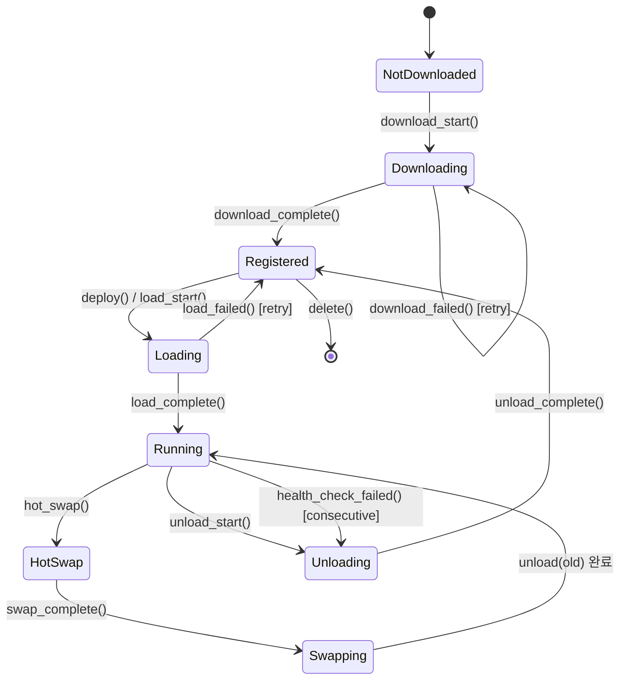
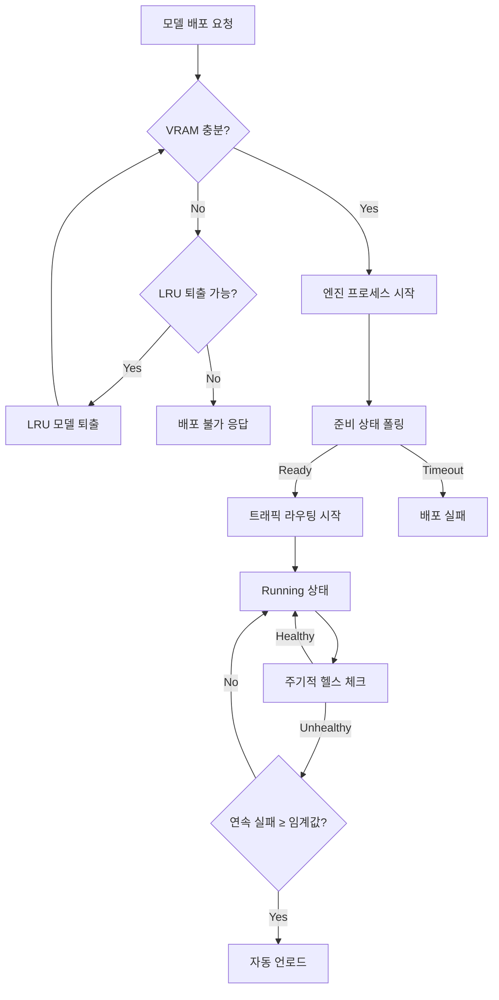
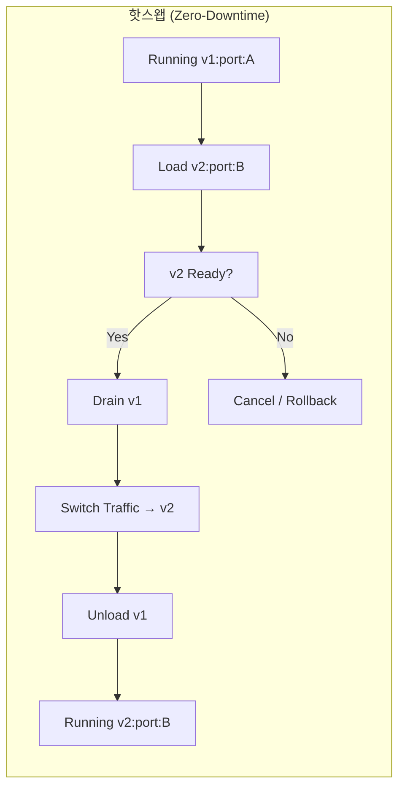

# Gadgetron 모델 서빙 엔진 (Model Serving Engine)

> 모듈 경로: `gadgetron-provider`, `gadgetron-scheduler`, `gadgetron-node`
> 버전: 0.1.0-draft | 최종 수정: 2026-04-11
> 담당: Serving Lead

---

## 목차

1. [개요](#1-개요)
2. [엔진 어댑터 — 퍼스트 클래스 (First-Class)](#2-엔진-어댑터--퍼스트-클래스-first-class)
3. [엔진 어댑터 — 세컨더리 (Secondary)](#3-엔진-어댑터--세컨더리-secondary)
4. [모델 라이프사이클 상태 머신](#4-모델-라이프사이클-상태-머신)
5. [VRAM 추정 및 스케줄링](#5-vram-추정-및-스케줄링)
6. [NUMA 인식 병렬 처리 구성](#6-numa-인식-병렬-처리-구성)
7. [모델 다운로드 및 카탈로그](#7-모델-다운로드-및-카탈로그)
8. [프로파일링 기반 자동 튜닝](#8-프로파일링-및-자동-튜닝)
9. [핫스왑 및 제로 다운타임 업데이트](#9-핫스왑-및-제로-다운타임-업데이트)
10. [Rust 크레이트 및 API](#10-rust-크레이트-및-api)
11. [설정 예시](#11-설정-예시)

---

## 1. 개요

Gadgetron의 모델 서빙 엔진은 다양한 LLM 추론 백엔드(vLLM, SGLang, Ollama, llama.cpp, TGI)를 통합 관리하는 오케스트레이션 계층이다. 핵심 목표는 다음과 같다.

- **다중 엔진 통합**: 각 엔진의 특성에 맞는 어댑터를 통해 단일 인터페이스로 모델 서빙
- **GPU 리소스 효율화**: VRAM 추정 기반 스케줄링, 다중 모델 패킹, LRU 퇴출 정책
- **NUMA 인식 병렬 처리**: GPU/NUMA 토폴로지 기반 자동 병렬 구성
- **제로 다운타임**: 핫스왑, 드레이닝, 버전 핀닝을 통한 무중단 모델 교체
- **자동 튜닝**: 프로파일링 기반 최적 배치 크기, KV 캐시 크기, 엔진 선택 자동화

아키텍처 개요도:

```
┌─────────────────────────────────────────────────────────────┐
│                    Gadgetron API Gateway                     │
├─────────────────────────────────────────────────────────────┤
│  gadgetron-scheduler                                         │
│  ┌───────────┐ ┌──────────────┐ ┌────────────────────┐     │
│  │ VRAM      │ │ Lifecycle    │ │ NUMA-Aware         │     │
│  │ Estimator │ │ State Machine│ │ Parallelism Config  │     │
│  └─────┬─────┘ └──────┬───────┘ └─────────┬──────────┘     │
│        │               │                   │                 │
│  ┌─────▼───────────────▼───────────────────▼──────────┐     │
│  │           LlmProvider Trait (gadgetron-provider)   │     │
│  ├──────────┬──────────┬──────────┬────────┬─────────┤     │
│  │  vLLM    │  SGLang  │  Ollama  │llama.cpp│   TGI   │     │
│  │ Adapter  │ Adapter  │ Adapter  │ Adapter │ Adapter │     │
│  └────┬─────┴────┬─────┴────┬─────┴────┬───┴────┬────┘     │
├───────┼──────────┼──────────┼──────────┼───────┼───────────┤
│  gadgetron-node  │          │          │       │           │
│  ┌────▼────┐┌────▼────┐┌───▼────┐┌────▼───┐┌───▼────┐    │
│  │Process  ││Process  ││Process ││Process ││Process │    │
│  │Manager  ││Manager  ││Manager ││Manager ││Manager │    │
│  │(vLLM)   ││(SGLang) ││(Ollama)││(llama) ││(TGI)   │    │
│  └─────────┘└─────────┘└────────┘└────────┘└────────┘    │
├─────────────────────────────────────────────────────────────┤
│  GPU Pool  │  GPU 0  │  GPU 1  │  GPU 2  │  GPU 3  │       │
└─────────────────────────────────────────────────────────────┘
```

---

## 2. 엔진 어댑터 — 퍼스트 클래스 (First-Class)

vLLM과 SGLang은 Gadgetron의 퍼스트 클래스 엔진으로, 모든 핵심 기능(핫스왑, 프로파일링, NUMA 구성 등)을 완벽하게 지원한다.

### 2.1 vLLM 어댑터

#### 특징

| 항목 | 설명 |
|------|------|
| API 호환성 | OpenAI Compatible API (`/v1/completions`, `/v1/chat/completions`, `/v1/models`) |
| 어텐션 메커니즘 | PagedAttention — KV 캐시를 페이지 단위로 관리하여 메모리 단편화 최소화 |
| 배칭 | Continuous Batching — 요청이 완료되면 즉시 슬롯을 반납하고 새 요청 수용 |
| 프로세스 모델 | Process-per-Model: 모델 인스턴스당 독립 프로세스 |
| 병렬 처리 | Tensor Parallelism (`--tensor-parallel-size`), Pipeline Parallelism (`--pipeline-parallel-size`) |
| 헬스 체크 | `GET /health` — 200 OK 시 정상 |
| 메트릭 | `GET /metrics` — Prometheus 포맷 (Prometheus 멀티 프로세스 모드 지원) |

#### vLLM 프로세스 실행 인자

```rust
/// gadgetron-provider/src/vllm.rs

/// vLLM 엔진 실행 인자
#[derive(Debug, Clone, Serialize, Deserialize)]
pub struct VllmArgs {
    /// 모델 경로 (HuggingFace ID 또는 로컬 경로)
    pub model: String,

    /// 텐서 병렬 크기 (기본값: 1)
    #[serde(default = "default_tp")]
    pub tensor_parallel_size: u32,

    /// 파이프라인 병렬 크기 (기본값: 1)
    #[serde(default = "default_one")]
    pub pipeline_parallel_size: u32,

    /// MoE 전문가 병렬 크기 (기본값: 1)
    #[serde(default = "default_one")]
    pub expert_parallel_size: u32,

    /// 최대 시퀀스 길이
    pub max_model_len: Option<u32>,

    /// 최대 배치 크기 (maximum number of sequences)
    pub max_num_seqs: Option<u32>,

    /// GPU 메모리 활용률 (0.0 ~ 1.0, 기본값: 0.9)
    #[serde(default = "default_gpu_util")]
    pub gpu_memory_utilization: f64,

    /// KV 캐시 dtype (예: "auto", "fp8_e5m2")
    pub kv_cache_dtype: Option<String>,

    /// 양자화 방식 (예: "awq", "gptq", "squeezellm")
    pub quantization: Option<String>,

    /// Enforce eager 모드 (CUDA 그래프 비활성화)
    #[serde(default)]
    pub enforce_eager: bool,

    /// 서빙 호스트
    #[serde(default = "default_host")]
    pub host: String,

    /// 서빙 포트
    pub port: u16,

    /// 추가 실행 인자 (엔진 특화)
    #[serde(default)]
    pub extra_args: HashMap<String, String>,
}

fn default_tp() -> u32 { 1 }
fn default_one() -> u32 { 1 }
fn default_gpu_util() -> f64 { 0.9 }
fn default_host() -> String { "0.0.0.0".to_string() }
```

#### vLLM 어댑터 구현

```rust
/// gadgetron-provider/src/vllm.rs

#[async_trait]
impl LlmProvider for VllmProvider {
    /// 엔진 타입 반환
    fn engine_type(&self) -> EngineType {
        EngineType::Vllm
    }

    /// 엔진 프로세스 시작
    async fn start(&self, config: &ModelConfig) -> Result<ProcessHandle> {
        let args = VllmArgs::from_config(config)?;
        let cmd = self.build_command(&args)?;
        self.process_manager.spawn(cmd, config.instance_id()).await
    }

    /// 엔진 프로세스 정지
    async fn stop(&self, instance_id: &str) -> Result<()> {
        self.process_manager.terminate(instance_id).await
    }

    /// 헬스 체크: GET /health
    async fn health_check(&self, endpoint: &EndpointConfig) -> Result<HealthStatus> {
        let url = format!("http://{}:{}/health", endpoint.host, endpoint.port);
        let response = self.http_client.get(&url)
            .timeout(Duration::from_secs(5))
            .send().await?;

        match response.status() {
            StatusCode::OK => Ok(HealthStatus::Healthy),
            _ => Ok(HealthStatus::Unhealthy {
                reason: format!("vLLM /health returned {}", response.status()),
            }),
        }
    }

    /// 준비 상태 확인: /health + /v1/models 응답 확인
    async fn readiness_check(&self, endpoint: &EndpointConfig) -> Result<ReadinessStatus> {
        let health = self.health_check(endpoint).await?;
        if !health.is_healthy() {
            return Ok(ReadinessStatus::NotReady { reason: health.reason() });
        }
        let url = format!("http://{}:{}/v1/models", endpoint.host, endpoint.port);
        let resp = self.http_client.get(&url)
            .timeout(Duration::from_secs(3))
            .send().await?;

        match resp.status() {
            StatusCode::OK => Ok(ReadinessStatus::Ready),
            _ => Ok(ReadinessStatus::NotReady {
                reason: "vLLM /v1/models not responding".into(),
            }),
        }
    }

    /// Prometheus 메트릭 수집: GET /metrics
    async fn collect_metrics(&self, endpoint: &EndpointConfig) -> Result<EngineMetrics> {
        let url = format!("http://{}:{}/metrics", endpoint.host, endpoint.port);
        let resp = self.http_client.get(&url)
            .timeout(Duration::from_secs(10))
            .send().await?;
        let body = resp.text().await?;
        self.parse_prometheus_metrics(&body)
    }

    /// 추론 요청 (OpenAI Compatible API)
    async fn complete(
        &self,
        endpoint: &EndpointConfig,
        request: CompletionRequest,
    ) -> Result<CompletionResponse> {
        let url = format!("http://{}:{}/v1/completions", endpoint.host, endpoint.port);
        self.openai_client.complete(&url, request).await
    }

    /// 채팅 추론 요청 (OpenAI Compatible API)
    async fn chat_complete(
        &self,
        endpoint: &EndpointConfig,
        request: ChatCompletionRequest,
    ) -> Result<ChatCompletionResponse> {
        let url = format!("http://{}:{}/v1/chat/completions", endpoint.host, endpoint.port);
        self.openai_client.chat_complete(&url, request).await
    }
}
```

### 2.2 SGLang 어댑터

#### 특징

| 항목 | 설명 |
|------|------|
| API 호환성 | OpenAI Compatible API (`/v1/completions`, `//v1/chat/completions`, `/v1/models`) |
| 어텐션 메커니즘 | RadixAttention — 공통 프리픽스를 자동 탐지하여 KV 캐시 재사용 |
| 스케줄링 | Overlap Scheduling — 프리필(prefill)과 디코드(decode) 단계를 중첩 실행 |
| 프로세스 모델 | Process-per-Model: 모델 인스턴스당 독립 프로세스 |
| 병렬 처리 | Tensor Parallelism (`--tp`), Data Parallelism (`--dp`) |
| 헬스 체크 | `GET /health` — 200 OK 시 정상 |
| 메트릭 | SGLang 자체 메트릭 엔드포인트 |

#### SGLang 프로세스 실행 인자

```rust
/// gadgetron-provider/src/sglang.rs

/// SGLang 엔진 실행 인자
#[derive(Debug, Clone, Serialize, Deserialize)]
pub struct SglangArgs {
    /// 모델 경로 (HuggingFace ID 또는 로컬 경로)
    pub model_path: String,

    /// 텐서 병렬 크기 (기본값: 1)
    #[serde(default = "default_tp")]
    pub tp: u32,

    /// 데이터 병렬 크기 (기본값: 1)
    #[serde(default = "default_one")]
    pub dp: u32,

    /// 호스트
    #[serde(default = "default_host")]
    pub host: String,

    /// 포트
    pub port: u16,

    /// 최대 실행 배치 크기
    pub max_running_requests: Option<u32>,

    /// GPU 메모리 활용률 (0.0 ~ 1.0)
    #[serde(default = "default_gpu_util")]
    pub mem_fraction_static: f64,

    /// KV 캐시 dtype
    pub kv_cache_dtype: Option<String>,

    /// 양자화 방식
    pub quantization: Option<String>,

    /// 추가 실행 인자
    #[serde(default)]
    pub extra_args: HashMap<String, String>,
}
```

#### SGLang 어댑터 구현

```rust
/// gadgetron-provider/src/sglang.rs

#[async_trait]
impl LlmProvider for SglangProvider {
    fn engine_type(&self) -> EngineType {
        EngineType::Sglang
    }

    async fn start(&self, config: &ModelConfig) -> Result<ProcessHandle> {
        let args = SglangArgs::from_config(config)?;
        let cmd = self.build_command(&args)?;
        self.process_manager.spawn(cmd, config.instance_id()).await
    }

    async fn stop(&self, instance_id: &str) -> Result<()> {
        self.process_manager.terminate(instance_id).await
    }

    /// SGLang 헬스 체크: GET /health
    async fn health_check(&self, endpoint: &EndpointConfig) -> Result<HealthStatus> {
        let url = format!("http://{}:{}/health", endpoint.host, endpoint.port);
        let response = self.http_client.get(&url)
            .timeout(Duration::from_secs(5))
            .send().await?;

        match response.status() {
            StatusCode::OK => Ok(HealthStatus::Healthy),
            _ => Ok(HealthStatus::Unhealthy {
                reason: format!("SGLang /health returned {}", response.status()),
            }),
        }
    }

    async fn readiness_check(&self, endpoint: &EndpointConfig) -> Result<ReadinessStatus> {
        let health = self.health_check(endpoint).await?;
        if !health.is_healthy() {
            return Ok(ReadinessStatus::NotReady { reason: health.reason() });
        }
        // SGLang: /v1/models로 실제 모델 로드 완료 확인
        let url = format!("http://{}:{}/v1/models", endpoint.host, endpoint.port);
        let resp = self.http_client.get(&url)
            .timeout(Duration::from_secs(3))
            .send().await?;
        match resp.status() {
            StatusCode::OK => Ok(ReadinessStatus::Ready),
            _ => Ok(ReadinessStatus::NotReady {
                reason: "SGLang /v1/models not responding".into(),
            }),
        }
    }

    async fn collect_metrics(&self, endpoint: &EndpointConfig) -> Result<EngineMetrics> {
        // SGLang은 /metrics 엔드포인트 또는 자체 메트릭 제공
        let url = format!("http://{}:{}/metrics", endpoint.host, endpoint.port);
        let resp = self.http_client.get(&url)
            .timeout(Duration::from_secs(10))
            .send().await?;
        let body = resp.text().await?;
        self.parse_sglang_metrics(&body)
    }

    async fn complete(
        &self,
        endpoint: &EndpointConfig,
        request: CompletionRequest,
    ) -> Result<CompletionResponse> {
        let url = format!("http://{}:{}/v1/completions", endpoint.host, endpoint.port);
        self.openai_client.complete(&url, request).await
    }

    async fn chat_complete(
        &self,
        endpoint: &EndpointConfig,
        request: ChatCompletionRequest,
    ) -> Result<ChatCompletionResponse> {
        let url = format!("http://{}:{}/v1/chat/completions", endpoint.host, endpoint.port);
        self.openai_client.chat_complete(&url, request).await
    }
}
```

### 2.3 공통 엔드포인트 설정

```rust
/// gadgetron-provider/src/config.rs

/// 엔진 엔드포인트 설정
#[derive(Debug, Clone, Serialize, Deserialize)]
pub struct EndpointConfig {
    /// 엔진 서버 호스트
    pub host: String,

    /// 엔진 서버 포트
    pub port: u16,

    /// 선택적 API 키 (vLLM/SGLang 모두 지원)
    #[serde(default)]
    pub api_key: Option<String>,

    /// 연결 타임아웃 (밀리초, 기본값: 5000)
    #[serde(default = "default_connect_timeout")]
    pub connect_timeout_ms: u64,

    /// 요청 타임아웃 (밀리초, 기본값: 30000)
    #[serde(default = "default_request_timeout")]
    pub request_timeout_ms: u64,
}

/// 모델 경로 설정
#[derive(Debug, Clone, Serialize, Deserialize)]
pub struct ModelPathConfig {
    /// HuggingFace 모델 ID (예: "meta-llama/Meta-Llama-3-70B")
    pub hf_model_id: Option<String>,

    /// 로컬 모델 경로 (예: "/data/models/llama-3-70b")
    pub local_path: Option<String>,

    /// GGUF 파일 경로 (llama.cpp용)
    pub gguf_path: Option<String>,
}

fn default_connect_timeout() -> u64 { 5000 }
fn default_request_timeout() -> u64 { 30000 }
```

---

## 3. 엔진 어댑터 — 세컨더리 (Secondary)

세컨더리 엔진은 핵심 서빙 기능을 지원하지만, 일부 고급 기능(핫스왑, NUMA 자동 구성 등)이 제한될 수 있다.

### 3.1 Ollama 어댑터

Ollama는 다른 엔진과 달리 **풀 라이프사이클 API**를 제공하여 모델의 로드/언로드를 런타임에 제어할 수 있다.

| 항목 | 설명 |
|------|------|
| API | `/api/generate`, `/api/chat`, `/api/tags`, `/api/pull`, `/api/show` |
| 라이프사이클 | 풀 라이프사이클: `pull` → `load` → `generate` → `unload` |
| 다중 모델 | 네이티브 지원 (단일 프로세스에서 다중 모델 동시 실행) |
| 헬스 체크 | `GET /` — 200 OK 시 정상 |
| 모델 목록 | `GET /api/tags` — 로드된 모델 목록 반환 |
| 상태 확인 | `GET /api/ps` — 현재 실행 중인 모델 및 VRAM 사용량 |

```rust
/// gadgetron-provider/src/ollama.rs

#[async_trait]
impl LlmProvider for OllamaProvider {
    fn engine_type(&self) -> EngineType {
        EngineType::Ollama
    }

    /// Ollama는 단일 프로세스 모델이 아님 — 데몬이 이미 실행 중이어야 함
    async fn start(&self, config: &ModelConfig) -> Result<ProcessHandle> {
        // 1. Ollama 데몬 실행 확인 (없으면 시작)
        self.ensure_daemon_running().await?;

        // 2. 모델이 로컬에 없으면 pull
        if !self.model_exists_locally(&config.model_name).await? {
            self.pull_model(&config.model_name).await?;
        }

        // 3. /api/generate로 웜업 요청 (모델을 VRAM에 로드)
        self.warmup_model(&config.model_name).await?;

        Ok(ProcessHandle::daemon_managed(config.instance_id()))
    }

    async fn stop(&self, instance_id: &str) -> Result<()> {
        // Ollama: /api/ps로 모델 언로드 (keep_alive=0)
        self.unload_model(instance_id).await
    }

    /// Ollama 헬스 체크: GET /
    async fn health_check(&self, endpoint: &EndpointConfig) -> Result<HealthStatus> {
        let url = format!("http://{}:{}/", endpoint.host, endpoint.port);
        let response = self.http_client.get(&url)
            .timeout(Duration::from_secs(5))
            .send().await?;
        match response.status() {
            StatusCode::OK => Ok(HealthStatus::Healthy),
            _ => Ok(HealthStatus::Unhealthy {
                reason: format!("Ollama / returned {}", response.status()),
            }),
        }
    }

    /// Ollama 준비 상태: GET /api/ps로 실행 중인 모델 확인
    async fn readiness_check(&self, endpoint: &EndpointConfig) -> Result<ReadinessStatus> {
        let url = format!("http://{}:{}/api/ps", endpoint.host, endpoint.port);
        let resp = self.http_client.get(&url)
            .timeout(Duration::from_secs(3))
            .send().await?;
        let body: OllamaPsResponse = resp.json().await?;
        if body.models.iter().any(|m| m.name == self.model_name) {
            Ok(ReadinessStatus::Ready)
        } else {
            Ok(ReadinessStatus::NotReady {
                reason: format!("Model {} not loaded in Ollama", self.model_name),
            })
        }
    }

    /// Ollama 전용: 모델 다운로드 (pull)
    async fn pull_model(&self, model_name: &str) -> Result<PullResult> {
        let url = format!("http://{}:{}/api/pull", self.endpoint.host, self.endpoint.port);
        let resp = self.http_client.post(&url)
            .json(&serde_json::json!({ "name": model_name, "stream": false }))
            .send().await?;
        // 스트리밍 진행률 처리...
        Ok(PullResult::completed(model_name))
    }

    /// Ollama 전용: 모델 언로드 (keep_alive=0)
    async fn unload_model(&self, model_name: &str) -> Result<()> {
        let url = format!("http://{}:{}/api/generate", self.endpoint.host, self.endpoint.port);
        self.http_client.post(&url)
            .json(&serde_json::json!({
                "model": model_name,
                "keep_alive": 0,
                "prompt": ""
            }))
            .send().await?;
        Ok(())
    }

    /// Ollama 전용: 실행 중인 모델 목록
    async fn list_running_models(&self) -> Result<Vec<OllamaModelInfo>> {
        let url = format!("http://{}:{}/api/ps", self.endpoint.host, self.endpoint.port);
        let resp = self.http_client.get(&url).send().await?;
        let body: OllamaPsResponse = resp.json().await?;
        Ok(body.models)
    }

    /// 추론: /api/generate
    async fn complete(
        &self,
        endpoint: &EndpointConfig,
        request: CompletionRequest,
    ) -> Result<CompletionResponse> {
        let url = format!("http://{}:{}/api/generate", endpoint.host, endpoint.port);
        self.ollama_client.complete(&url, request).await
    }

    /// 채팅 추론: /api/chat
    async fn chat_complete(
        &self,
        endpoint: &EndpointConfig,
        request: ChatCompletionRequest,
    ) -> Result<ChatCompletionResponse> {
        let url = format!("http://{}:{}/api/chat", endpoint.host, endpoint.port);
        self.ollama_client.chat_complete(&url, request).await
    }
}
```

### 3.2 llama.cpp 어댑터

| 항목 | 설명 |
|------|------|
| 프로세스 모델 | Process-per-Model: 모델 인스턴스당 독립 프로세스 |
| 슬롯 관리 | `GET /slots` — 각 슬롯의 상태(idle/processing) 및 프롬프트 정보 반환 |
| 헬스 체크 | `GET /health` — 200 OK 시 정상 |
| API | OpenAI 호환 엔드포인트 지원 |

```rust
/// gadgetron-provider/src/llamacpp.rs

#[async_trait]
impl LlmProvider for LlamaCppProvider {
    fn engine_type(&self) -> EngineType {
        EngineType::LlamaCpp
    }

    async fn start(&self, config: &ModelConfig) -> Result<ProcessHandle> {
        let args = LlamaCppArgs::from_config(config)?;
        let cmd = self.build_command(&args)?;
        self.process_manager.spawn(cmd, config.instance_id()).await
    }

    async fn stop(&self, instance_id: &str) -> Result<()> {
        self.process_manager.terminate(instance_id).await
    }

    /// llama.cpp 헬스 체크: GET /health
    async fn health_check(&self, endpoint: &EndpointConfig) -> Result<HealthStatus> {
        let url = format!("http://{}:{}/health", endpoint.host, endpoint.port);
        let response = self.http_client.get(&url)
            .timeout(Duration::from_secs(5))
            .send().await?;
        match response.status() {
            StatusCode::OK => Ok(HealthStatus::Healthy),
            _ => Ok(HealthStatus::Unhealthy {
                reason: format!("llama.cpp /health returned {}", response.status()),
            }),
        }
    }

    /// 슬롯 상태 조회: GET /slots
    async fn slot_status(&self, endpoint: &EndpointConfig) -> Result<Vec<SlotInfo>> {
        let url = format!("http://{}:{}/slots", endpoint.host, endpoint.port);
        let resp = self.http_client.get(&url)
            .timeout(Duration::from_secs(3))
            .send().await?;
        let slots: Vec<SlotInfo> = resp.json().await?;
        Ok(slots)
    }

    async fn readiness_check(&self, endpoint: &EndpointConfig) -> Result<ReadinessStatus> {
        let health = self.health_check(endpoint).await?;
        if !health.is_healthy() {
            return Ok(ReadinessStatus::NotReady { reason: health.reason() });
        }
        let slots = self.slot_status(endpoint).await?;
        // 최소 하나의 idle 슬롯이 있으면 준비 완료
        if slots.iter().any(|s| s.state == "idle") {
            Ok(ReadinessStatus::Ready)
        } else {
            Ok(ReadinessStatus::NotReady {
                reason: "All llama.cpp slots are busy".into(),
            })
        }
    }

    async fn complete(
        &self,
        endpoint: &EndpointConfig,
        request: CompletionRequest,
    ) -> Result<CompletionResponse> {
        let url = format!("http://{}:{}/v1/completions", endpoint.host, endpoint.port);
        self.openai_client.complete(&url, request).await
    }

    async fn chat_complete(
        &self,
        endpoint: &EndpointConfig,
        request: ChatCompletionRequest,
    ) -> Result<ChatCompletionResponse> {
        let url = format!("http://{}:{}/v1/chat/completions", endpoint.host, endpoint.port);
        self.openai_client.chat_complete(&url, request).await
    }
}

/// llama.cpp 슬롯 정보
#[derive(Debug, Deserialize)]
pub struct SlotInfo {
    pub id: u32,
    pub state: String,     // "idle" | "processing"
    pub prompt: Option<String>,
    pub n_prompt_tokens: Option<u32>,
    pub n_tokens: Option<u32>,
}
```

### 3.3 TGI (Text Generation Inference) 어댑터

| 항목 | 설명 |
|------|------|
| 프로세스 모델 | Process-per-Model: 모델 인스턴스당 독립 프로세스 |
| 정보 엔드포인트 | `GET /info` — 모델 메타데이터, 어휘 크기, 최대 입력 길이 등 반환 |
| 헬스 체크 | `GET /health` — 200 OK 시 정상 |
| 최적화 기능 | Flash Attention, Watermark(생성 텍스트 워터마킹), 연속 배칭 |
| API | OpenAI 호환 엔드포인트 지원 |

```rust
/// gadgetron-provider/src/tgi.rs

#[async_trait]
impl LlmProvider for TgiProvider {
    fn engine_type(&self) -> EngineType {
        EngineType::Tgi
    }

    async fn start(&self, config: &ModelConfig) -> Result<ProcessHandle> {
        let args = TgiArgs::from_config(config)?;
        let cmd = self.build_command(&args)?;
        self.process_manager.spawn(cmd, config.instance_id()).await
    }

    async fn stop(&self, instance_id: &str) -> Result<()> {
        self.process_manager.terminate(instance_id).await
    }

    /// TGI 헬스 체크: GET /health
    async fn health_check(&self, endpoint: &EndpointConfig) -> Result<HealthStatus> {
        let url = format!("http://{}:{}/health", endpoint.host, endpoint.port);
        let response = self.http_client.get(&url)
            .timeout(Duration::from_secs(5))
            .send().await?;
        match response.status() {
            StatusCode::OK => Ok(HealthStatus::Healthy),
            _ => Ok(HealthStatus::Unhealthy {
                reason: format!("TGI /health returned {}", response.status()),
            }),
        }
    }

    /// TGI 정보 조회: GET /info
    async fn model_info(&self, endpoint: &EndpointConfig) -> Result<TgiModelInfo> {
        let url = format!("http://{}:{}/info", endpoint.host, endpoint.port);
        let resp = self.http_client.get(&url)
            .timeout(Duration::from_secs(3))
            .send().await?;
        let info: TgiModelInfo = resp.json().await?;
        Ok(info)
    }

    async fn readiness_check(&self, endpoint: &EndpointConfig) -> Result<ReadinessStatus> {
        let health = self.health_check(endpoint).await?;
        if !health.is_healthy() {
            return Ok(ReadinessStatus::NotReady { reason: health.reason() });
        }
        let info = self.model_info(endpoint).await?;
        if info.model_id.is_some() {
            Ok(ReadinessStatus::Ready)
        } else {
            Ok(ReadinessStatus::NotReady {
                reason: "TGI /info returned no model_id".into(),
            })
        }
    }

    async fn complete(
        &self,
        endpoint: &EndpointConfig,
        request: CompletionRequest,
    ) -> Result<CompletionResponse> {
        let url = format!("http://{}:{}/v1/completions", endpoint.host, endpoint.port);
        self.openai_client.complete(&url, request).await
    }

    async fn chat_complete(
        &self,
        endpoint: &EndpointConfig,
        request: ChatCompletionRequest,
    ) -> Result<ChatCompletionResponse> {
        let url = format!("http://{}:{}/v1/chat/completions", endpoint.host, endpoint.port);
        self.openai_client.chat_complete(&url, request).await
    }
}

/// TGI 모델 정보
#[derive(Debug, Deserialize)]
pub struct TgiModelInfo {
    pub model_id: Option<String>,
    pub model_sha: Option<String>,
    pub model_dtype: Option<String>,
    pub model_pipeline_tag: Option<String>,
    pub max_concurrent_requests: Option<u32>,
    pub max_input_length: Option<u32>,
    pub max_total_tokens: Option<u32>,
    pub max_batch_size: Option<u32>,
    pub flash_attention_enabled: Option<bool>,
    pub watermark_enabled: Option<bool>,
}
```

### 3.4 어댑터 공통 트레이트

```rust
/// gadgetron-provider/src/lib.rs

/// 모든 LLM 서빙 엔진이 구현해야 하는 트레이트
#[async_trait]
pub trait LlmProvider: Send + Sync {
    /// 엔진 타입 반환
    fn engine_type(&self) -> EngineType;

    /// 엔진 프로세스 시작 (Ollama는 데몬 관리)
    async fn start(&self, config: &ModelConfig) -> Result<ProcessHandle>;

    /// 엔진 프로세스 정지
    async fn stop(&self, instance_id: &str) -> Result<()>;

    /// 헬스 체크
    async fn health_check(&self, endpoint: &EndpointConfig) -> Result<HealthStatus>;

    /// 준비 상태 확인 (모델 로드 완료 및 요청 수용 가능 상태)
    async fn readiness_check(&self, endpoint: &EndpointConfig) -> Result<ReadinessStatus>;

    /// 텍스트 완성 요청
    async fn complete(
        &self,
        endpoint: &EndpointConfig,
        request: CompletionRequest,
    ) -> Result<CompletionResponse>;

    /// 채팅 완성 요청
    async fn chat_complete(
        &self,
        endpoint: &EndpointConfig,
        request: ChatCompletionRequest,
    ) -> Result<ChatCompletionResponse>;

    /// 메트릭 수집 (선택 구현)
    async fn collect_metrics(&self, endpoint: &EndpointConfig) -> Result<EngineMetrics> {
        Ok(EngineMetrics::default())
    }
}

/// 엔진 타입 열거형
#[derive(Debug, Clone, Copy, PartialEq, Eq, Serialize, Deserialize)]
#[serde(rename_all = "lowercase")]
pub enum EngineType {
    Vllm,
    Sglang,
    Ollama,
    LlamaCpp,
    Tgi,
}

/// 헬스 상태
#[derive(Debug, Clone)]
pub enum HealthStatus {
    Healthy,
    Unhealthy { reason: String },
    Degraded { reason: String },
}

/// 준비 상태
#[derive(Debug, Clone)]
pub enum ReadinessStatus {
    Ready,
    NotReady { reason: String },
}

/// 엔진 메트릭
#[derive(Debug, Default)]
pub struct EngineMetrics {
    pub num_requests_running: u64,
    pub num_requests_waiting: u64,
    pub gpu_cache_usage_pct: f64,
    pub cpu_cache_usage_pct: f64,
    pub avg_iteration_latency_ms: f64,
    pub total_num_tokens: u64,
    pub batch_size: u64,
}
```

---

## 4. 모델 라이프사이클 상태 머신

### 4.1 상태 전이도

```
                         ┌───────────────────┐
                         │  NotDownloaded    │
                         └────────┬──────────┘
                                  │  download_start()
                                  ▼
                         ┌───────────────────┐
                         │  Downloading      │◄──────────────┐
                         └────────┬──────────┘               │
                                  │  download_complete()      │ download_failed()
                                  ▼                           │ (retry)
                         ┌───────────────────┐               │
                         │  Registered       │───────────────┘
                         └────────┬──────────┘
                                  │  deploy() / load_start()
                       ┌──────────┼──────────────────────────────────┐
                       │          ▼                                  │
                       │  ┌───────────────────┐                     │
                       │  │  Loading          │                     │
                       │  └────────┬──────────┘                     │
                       │           │  load_complete()               │
                       │           ▼                                │
                       │  ┌───────────────────┐    hot_swap()       │
                       │  │  Running          │─────────────┐      │
                       │  └────────┬──────────┘             │      │
                       │           │                        ▼      │
                       │           │               ┌──────────────┐│
                       │           │               │  HotSwap     ││
                       │           │               └──────┬───────┘│
                       │           │                      │        │
                       │           │                      ▼        │
                       │           │               ┌──────────────┐│
                       │           │               │  Swapping    ││
                       │           │               └──────┬───────┘│
                       │           │                      │        │
                       │           │  ◄───────────────────┘        │
                       │           │  swap_complete()              │
                       │           │                               │
                       │  unload_start()                           │
                       │           │                               │
                       ▼           ▼                               │
                  ┌───────────────────┐                            │
                  │  Unloading        │                            │
                  └────────┬──────────┘                            │
                           │  unload_complete()                    │
                           ▼                                       │
                  ┌───────────────────┐                            │
                  │  Registered       │────────────────────────────┘
                  └───────────────────┘   (reload for retry)
```

### 4.2 상태 정의

```rust
/// gadgetron-scheduler/src/lifecycle.rs

/// 모델 라이프사이클 상태
#[derive(Debug, Clone, PartialEq, Eq, Serialize, Deserialize)]
#[serde(rename_all = "snake_case")]
pub enum ModelState {
    /// 모델이 아직 다운로드되지 않음
    NotDownloaded,

    /// 모델 다운로드 진행 중 (progress: 0.0 ~ 1.0)
    Downloading {
        progress: f64,
        bytes_downloaded: u64,
        bytes_total: u64,
    },

    /// 모델이 다운로드 완료되어 레지스트리에 등록됨 (아직 로드되지 않음)
    Registered,

    /// 모델을 VRAM에 로드 중 (엔진 프로세스 시작, 모델 가중치 로딩)
    Loading {
        started_at: DateTime<Utc>,
    },

    /// 모델이 실행 중이며 요청을 처리할 수 있음
    Running {
        started_at: DateTime<Utc>,
        vram_usage_mb: u64,
        endpoint: EndpointConfig,
    },

    /// 핫스왑 진행 중: 새 버전 로드와 동시에 기존 버전 드레이닝
    HotSwap {
        old_version: String,
        new_version: String,
        old_endpoint: EndpointConfig,
        new_endpoint: EndpointConfig,
        draining: bool,
    },

    /// 핫스왑 교체 중: 트래픽을 새 버전으로 전환하고 기존 버전 언로드
    Swapping {
        old_version: String,
        new_version: String,
    },

    /// 모델을 VRAM에서 언로드 중
    Unloading {
        started_at: DateTime<Utc>,
    },
}

/// 상태 전이 이벤트
#[derive(Debug, Clone)]
pub enum LifecycleEvent {
    /// 다운로드 시작
    DownloadStart { model_id: String },
    /// 다운로드 진행률 업데이트
    DownloadProgress { model_id: String, progress: f64 },
    /// 다운로드 완료
    DownloadComplete { model_id: String },
    /// 다운로드 실패
    DownloadFailed { model_id: String, error: String },
    /// 모델 배포 (로드 시작)
    Deploy { model_id: String, version: String },
    /// 로드 완료
    LoadComplete { model_id: String, endpoint: EndpointConfig, vram_usage_mb: u64 },
    /// 로드 실패
    LoadFailed { model_id: String, error: String },
    /// 핫스왑 시작
    HotSwapStart { model_id: String, old_version: String, new_version: String },
    /// 핫스왑 완료 (트래픽 전환 완료)
    SwapComplete { model_id: String },
    /// 언로드 시작
    UnloadStart { model_id: String },
    /// 언로드 완료
    UnloadComplete { model_id: String },
    /// 헬스 체크 실패
    HealthCheckFailed { model_id: String, reason: String },
}
```

### 4.3 상태 전이 규칙

```
┌─────────────────┬─────────────────────────────┬──────────────────────┐
│ 현재 상태        │ 이벤트                       │ 다음 상태             │
├─────────────────┼─────────────────────────────┼──────────────────────┤
│ NotDownloaded   │ DownloadStart               │ Downloading          │
│ Downloading     │ DownloadComplete            │ Registered           │
│ Downloading     │ DownloadFailed              │ Downloading (retry)  │
│ Registered      │ Deploy                      │ Loading              │
│ Loading         │ LoadComplete                │ Running              │
│ Loading         │ LoadFailed                  │ Registered (retry)   │
│ Running         │ HotSwapStart                │ HotSwap              │
│ Running         │ UnloadStart                 │ Unloading            │
│ Running         │ HealthCheckFailed (연속)     │ Unloading → Registered│
│ HotSwap         │ SwapComplete                │ Swapping             │
│ Swapping        │ unload(old) 완료            │ Running (new ver.)   │
│ Unloading       │ UnloadComplete              │ Registered           │
└─────────────────┴─────────────────────────────┴──────────────────────┘
```

### 4.4 엔진별 라이프사이클 관리 명령

```rust
/// gadgetron-scheduler/src/lifecycle.rs

/// 엔진별 라이프사이클 명령 매핑
impl LifecycleManager {
    /// 모델 로드 — 엔진별 차이 처리
    pub async fn load_model(&self, model: &ModelInstance) -> Result<()> {
        match model.engine_type() {
            EngineType::Vllm | EngineType::Sglang | EngineType::LlamaCpp | EngineType::Tgi => {
                // Process-per-Model: 새 프로세스 시작
                let provider = self.provider_registry.get(model.engine_type())?;
                provider.start(model.config()).await?;
                // 준비 상태 폴링
                self.poll_readiness(model, provider).await?;
            }
            EngineType::Ollama => {
                // Ollama: 데몬에 모델 로드 요청 (keep_alive 설정)
                let provider = self.provider_registry.get(EngineType::Ollama)?;
                provider.start(model.config()).await?;
            }
        }
        Ok(())
    }

    /// 모델 언로드 — 엔진별 차이 처리
    pub async fn unload_model(&self, model: &ModelInstance) -> Result<()> {
        match model.engine_type() {
            EngineType::Vllm | EngineType::Sglang | EngineType::LlamaCpp | EngineType::Tgi => {
                // Process-per-Model: 프로세스 종료
                let provider = self.provider_registry.get(model.engine_type())?;
                provider.stop(model.instance_id()).await?;
            }
            EngineType::Ollama => {
                // Ollama: keep_alive=0으로 언로드
                let provider = self.provider_registry.get(EngineType::Ollama)?;
                provider.stop(model.instance_id()).await?;
            }
        }
        Ok(())
    }
}
```

### 4.5 헬스 체크 및 준비 상태 프로브

```rust
/// gadgetron-scheduler/src/health.rs

/// 헬스 체크 구성
#[derive(Debug, Clone, Serialize, Deserialize)]
pub struct HealthCheckConfig {
    /// 헬스 체크 간격 (기본값: 10초)
    #[serde(default = "default_interval")]
    pub interval_secs: u64,

    /// 타임아웃 (기본값: 5초)
    #[serde(default = "default_timeout")]
    pub timeout_secs: u64,

    /// 연속 실패 임계값 (이 값 초과 시 Unhealthy로 전환, 기본값: 3)
    #[serde(default = "default_failure_threshold")]
    pub failure_threshold: u32,

    /// 연속 성공 임계값 (이 값 도달 시 Healthy로 복구, 기본값: 2)
    #[serde(default = "default_success_threshold")]
    pub success_threshold: u32,

    /// 준비 상태 프로브 초기 지연 (기본값: 30초, 모델 로드 대기)
    #[serde(default = "default_initial_delay")]
    pub initial_delay_secs: u64,
}

fn default_interval() -> u64 { 10 }
fn default_timeout() -> u64 { 5 }
fn default_failure_threshold() -> u32 { 3 }
fn default_success_threshold() -> u32 { 2 }
fn default_initial_delay() -> u64 { 30 }

/// 헬스 체커
pub struct HealthChecker {
    config: HealthCheckConfig,
    provider_registry: ProviderRegistry,
}

impl HealthChecker {
    /// 모델 인스턴스에 대한 주기적 헬스 체크 실행
    pub async fn run_check(&self, model: &ModelInstance) -> HealthCheckResult {
        let provider = self.provider_registry.get(model.engine_type())?;
        let endpoint = model.endpoint();

        // Liveness 프로브: 헬스 체크
        let health = tokio::time::timeout(
            Duration::from_secs(self.config.timeout_secs),
            provider.health_check(endpoint),
        ).await??;

        // Readiness 프로브: 준비 상태 확인
        let readiness = tokio::time::timeout(
            Duration::from_secs(self.config.timeout_secs),
            provider.readiness_check(endpoint),
        ).await??;

        Ok(HealthCheckResult {
            model_id: model.id().to_string(),
            health,
            readiness,
            checked_at: Utc::now(),
        })
    }
}
```

---

## 5. VRAM 추정 및 스케줄링

### 5.1 VRAM 추정 공식

```rust
/// gadgetron-scheduler/src/vram.rs

/// 양자화 방식에 따른 VRAM 추정
#[derive(Debug, Clone, Copy, Serialize, Deserialize)]
#[serde(rename_all = "snake_case")]
pub enum QuantizationType {
    /// FP16 (반정밀도): 파라미터당 2바이트
    Fp16,
    /// BF16 (bfloat16): 파라미터당 2바이트
    Bf16,
    /// FP8: 파라미터당 1바이트
    Fp8,
    /// Q4_K_M (4-bit 양자화, 평균): 파라미터당 약 0.6바이트
    Q4Km,
    /// Q5_K_M (5-bit 양자화): 파라미터당 약 0.7바이트
    Q5Km,
    /// Q8_0 (8-bit 양자화): 파라미터당 1바이트
    Q8_0,
    /// AWQ 4-bit: 파라미터당 약 0.6바이트
    Awq4bit,
    /// GPTQ 4-bit: 파라미터당 약 0.6바이트
    Gptq4bit,
}

impl QuantizationType {
    /// 파라미터당 바이트 수 반환
    pub fn bytes_per_param(&self) -> f64 {
        match self {
            Self::Fp16 | Self::Bf16 => 2.0,
            Self::Fp8 => 1.0,
            Self::Q4Km | Self::Awq4bit | Self::Gptq4bit => 0.6,
            Self::Q5Km => 0.7,
            Self::Q8_0 => 1.0,
        }
    }
}

/// VRAM 추정기
pub struct VramEstimator;

impl VramEstimator {
    /// 모델 VRAM 요구량 추정 (MB 단위)
    ///
    /// 공식:
    ///   vram_model = bytes_per_param × param_count
    ///   vram_overhead = 1 GB (런타임 오버헤드)
    ///   vram_kv_cache = estimated_kv_cache_mb
    ///   vram_total = vram_model + vram_overhead + vram_kv_cache
    ///
    /// FP16 예시: 70B 모델
    ///   vram_model = 2 × 70B = 140GB
    ///   vram_overhead = 1GB
    ///   vram_kv_cache ≈ 8GB (시퀀스 길이/배치 크기에 따라)
    ///   vram_total ≈ 149GB
    ///
    /// Q4_K_M 예시: 70B 모델
    ///   vram_model = 0.6 × 70B = 42GB
    ///   vram_overhead = 1GB
    ///   vram_kv_cache ≈ 4GB
    ///   vram_total ≈ 47GB
    pub fn estimate_vram_requirement(
        param_count_b: f64,
        quantization: QuantizationType,
        max_seq_len: u32,
        max_batch_size: u32,
        num_layers: u32,
        num_kv_heads: u32,
        head_dim: u32,
    ) -> VramEstimate {
        let bytes_per_param = quantization.bytes_per_param();

        // 모델 가중치 VRAM
        let model_weights_bytes = bytes_per_param * param_count_b * 1_000_000_000.0;
        let model_weights_mb = (model_weights_bytes / (1024.0 * 1024.0)).ceil() as u64;

        // 런타임 오버헤드 (CUDA 컨텍스트, Activation 메모리 등)
        let overhead_mb: u64 = 1024; // 1 GB

        // KV 캐시 추정
        // KV 캐시 크기 = 2 × num_layers × num_kv_heads × head_dim × max_seq_len × max_batch_size × 2bytes(FP16)
        let kv_bytes = 2.0 * num_layers as f64
            * num_kv_heads as f64
            * head_dim as f64
            * max_seq_len as f64
            * max_batch_size as f64
            * 2.0; // FP16 KV cache
        let kv_cache_mb = (kv_bytes / (1024.0 * 1024.0)).ceil() as u64;

        let total_mb = model_weights_mb + overhead_mb + kv_cache_mb;

        VramEstimate {
            model_weights_mb,
            overhead_mb,
            kv_cache_mb,
            total_mb,
            param_count_b,
            quantization,
        }
    }
}

/// VRAM 추정 결과
#[derive(Debug, Clone, Serialize, Deserialize)]
pub struct VramEstimate {
    /// 모델 가중치 VRAM (MB)
    pub model_weights_mb: u64,
    /// 런타임 오버헤드 (MB)
    pub overhead_mb: u64,
    /// KV 캐시 추정 (MB)
    pub kv_cache_mb: u64,
    /// 총 VRAM 요구량 (MB)
    pub total_mb: u64,
    /// 파라미터 수 (십억 단위)
    pub param_count_b: f64,
    /// 양자화 방식
    pub quantization: QuantizationType,
}
```

### 5.2 VRAM 스케줄링 결정

```rust
/// gadgetron-scheduler/src/scheduler.rs

/// 스케줄링 결정 로직
pub struct ModelScheduler {
    vram_tracker: Arc<VramTracker>,
    estimator: VramEstimator,
    policy: EvictionPolicy,
}

impl ModelScheduler {
    /// 모델 배포 가능 여부 확인
    ///
    /// 조건: available_vram >= model_vram_requirement
    pub async fn can_deploy(&self, model: &ModelCatalogEntry) -> ScheduleDecision {
        let estimate = self.estimator.estimate_vram_requirement(
            model.param_count_b,
            model.quantization,
            model.max_seq_len,
            model.max_batch_size,
            model.num_layers,
            model.num_kv_heads,
            model.head_dim,
        );

        let available = self.vram_tracker.available_vram_mb();

        if available >= estimate.total_mb {
            ScheduleDecision::Deployable {
                vram_required_mb: estimate.total_mb,
                vram_available_mb: available,
            }
        } else {
            let deficit = estimate.total_mb - available;
            // LRU 퇴출로 공간 확보 가능한지 확인
            let evictable = self.vram_tracker.evictable_vram_mb(&self.policy);
            if evictable >= deficit {
                ScheduleDecision::DeployableAfterEviction {
                    vram_required_mb: estimate.total_mb,
                    vram_available_mb: available,
                    evictable_vram_mb: evictable,
                    models_to_evict: self.vram_tracker.models_to_evict(deficit, &self.policy),
                }
            } else {
                ScheduleDecision::InsufficientVram {
                    vram_required_mb: estimate.total_mb,
                    vram_available_mb: available,
                    evictable_vram_mb: evictable,
                    deficit_mb: deficit,
                }
            }
        }
    }

    /// 다중 모델 패킹: 단일 GPU에 다중 모델 배치 가능 여부
    pub async fn compute_packing_plan(
        &self,
        models: &[ModelCatalogEntry],
    ) -> Vec<PackingGroup> {
        // First-Fit Decreasing (FFD) bin packing
        let mut sorted = models.to_vec();
        sorted.sort_by(|a, b| b.vram_requirement_mb.cmp(&a.vram_requirement_mb));

        let gpus = self.vram_tracker.gpu_devices();
        let mut groups: Vec<PackingGroup> = gpus.iter()
            .map(|gpu| PackingGroup {
                gpu_id: gpu.id,
                gpu_total_vram_mb: gpu.total_vram_mb,
                models: vec![],
                used_vram_mb: 0,
            })
            .collect();

        for model in sorted {
            let estimate = self.estimator.estimate_vram_requirement(
                model.param_count_b,
                model.quantization,
                model.max_seq_len,
                model.max_batch_size,
                model.num_layers,
                model.num_kv_heads,
                model.head_dim,
            );

            // GPU 메모리 활용률 한계 (예: 90%) 고려
            let usable_vram = (groups.iter().map(|g| g.gpu_total_vram_mb).max().unwrap_or(0) as f64 * 0.9) as u64;

            // 첫 번째로 수용 가능한 GPU에 배치
            if let Some(group) = groups.iter_mut().find(|g| {
                g.used_vram_mb + estimate.total_mb <= usable_vram
            }) {
                group.models.push(model.clone());
                group.used_vram_mb += estimate.total_mb;
            }
            // 수용 불가 시 새 GPU 필요 (또는 퇴출 고려)
        }

        groups
    }
}

/// 스케줄링 결정 결과
#[derive(Debug, Clone)]
pub enum ScheduleDecision {
    Deployable {
        vram_required_mb: u64,
        vram_available_mb: u64,
    },
    DeployableAfterEviction {
        vram_required_mb: u64,
        vram_available_mb: u64,
        evictable_vram_mb: u64,
        models_to_evict: Vec<String>,
    },
    InsufficientVram {
        vram_required_mb: u64,
        vram_available_mb: u64,
        evictable_vram_mb: u64,
        deficit_mb: u64,
    },
}

/// 다중 모델 패킹 그룹
#[derive(Debug, Clone)]
pub struct PackingGroup {
    pub gpu_id: u32,
    pub gpu_total_vram_mb: u64,
    pub models: Vec<ModelCatalogEntry>,
    pub used_vram_mb: u64,
}
```

### 5.3 LRU 퇴출 정책

```rust
/// gadgetron-scheduler/src/eviction.rs

/// 퇴출 정책
#[derive(Debug, Clone, Serialize, Deserialize)]
#[serde(rename_all = "snake_case")]
pub enum EvictionPolicy {
    /// LRU (Least Recently Used): 가장 오래 전에 사용된 모델 퇴출
    Lru,

    /// 우선순위 오버라이드: priority 값이 낮은 모델 우선 퇴출
    Priority {
        default_priority: i32,
    },

    /// 하이브리드: 우선순위 기반 + 동일 우선순위 내 LRU
    Hybrid {
        default_priority: i32,
    },
}

/// VRAM 추적기
pub struct VramTracker {
    gpu_devices: Vec<GpuDevice>,
    running_models: Arc<RwLock<HashMap<String, RunningModelInfo>>>,
}

/// 실행 중인 모델 정보
#[derive(Debug, Clone)]
pub struct RunningModelInfo {
    pub model_id: String,
    pub instance_id: String,
    pub gpu_id: u32,
    pub vram_usage_mb: u64,
    pub last_accessed_at: DateTime<Utc>,
    pub priority: i32,
    pub pinned: bool,  // 퇴출 방지 플래그
}

impl VramTracker {
    /// 사용 가능한 VRAM (MB)
    pub fn available_vram_mb(&self) -> u64 {
        let total: u64 = self.gpu_devices.iter().map(|g| g.total_vram_mb).sum();
        let used: u64 = self.running_models.read().unwrap()
            .values()
            .map(|m| m.vram_usage_mb)
            .sum();
        total.saturating_sub(used)
    }

    /// 퇴출 가능한 VRAM (MB)
    pub fn evictable_vram_mb(&self, policy: &EvictionPolicy) -> u64 {
        self.running_models.read().unwrap()
            .values()
            .filter(|m| !m.pinned && m.is_evictable(policy))
            .map(|m| m.vram_usage_mb)
            .sum()
    }

    /// 퇴출 대상 모델 목록 (주어진 VRAM 확보량까지)
    pub fn models_to_evict(&self, needed_mb: u64, policy: &EvictionPolicy) -> Vec<String> {
        let models = self.running_models.read().unwrap();
        let mut evictable: Vec<&RunningModelInfo> = models.values()
            .filter(|m| !m.pinned && m.is_evictable(policy))
            .collect();

        // 정책에 따라 정렬
        match policy {
            EvictionPolicy::Lru => {
                evictable.sort_by(|a, b| a.last_accessed_at.cmp(&b.last_accessed_at));
            }
            EvictionPolicy::Priority { .. } | EvictionPolicy::Hybrid { .. } => {
                evictable.sort_by(|a, b| {
                    a.priority.cmp(&b.priority)
                        .then(a.last_accessed_at.cmp(&b.last_accessed_at))
                });
            }
        }

        let mut accumulated = 0u64;
        evictable.iter()
            .take_while(|m| {
                let should_take = accumulated < needed_mb;
                if should_take {
                    accumulated += m.vram_usage_mb;
                }
                should_take
            })
            .map(|m| m.model_id.clone())
            .collect()
    }
}

impl RunningModelInfo {
    fn is_evictable(&self, policy: &EvictionPolicy) -> bool {
        if self.pinned {
            return false;
        }
        // 추가 퇴출 불가 조건을 정책별로 확장 가능
        true
    }
}
```

---

## 6. NUMA 인식 병렬 처리 구성

### 6.1 병렬 처리 유형

```
┌──────────────────────────────────────────────────────────────────┐
│                    병렬 처리 (Parallelism) 계층                   │
├──────────────────────────────────────────────────────────────────┤
│                                                                  │
│  ┌─────────────────┐  ┌──────────────────┐  ┌────────────────┐ │
│  │ Tensor Paralle- │  │ Pipeline Paralle- │  │ Expert Parall- │ │
│  │ lism (TP)       │  │ lism (PP)        │  │ elism (EP)     │ │
│  │                 │  │                  │  │                │ │
│  │ 모델의 각 레이어 │  │ 레이어를 여러    │  │ MoE 모델의 전문 │ │
│  │ 를 N개 GPU에    │  │ 스테이지로 분할   │  │ 가를 N개 GPU에  │ │
│  │ 분할하여 동시   │  │ 하여 파이프라인   │  │ 분산하여 처리   │ │
│  │ 연산            │  │ 처리              │  │                │ │
│  └─────────────────┘  └──────────────────┘  └────────────────┘ │
│                                                                  │
│  ┌──────────────────────────────────────────────────────────────┐│
│  │ Data Parallelism (DP)                                       ││
│  │                                                              ││
│  │ 동일한 모델 복제본을 N개 GPU에 배치하여                      ││
│  │ 처리량(throughput) 선형 증가                                  ││
│  └──────────────────────────────────────────────────────────────┘│
└──────────────────────────────────────────────────────────────────┘
```

### 6.2 엔진별 병렬 처리 인자 매핑

```
┌───────────────────┬───────────────────────┬─────────────────────┐
│ 병렬 처리 유형     │ vLLM 인자              │ SGLang 인자          │
├───────────────────┼───────────────────────┼─────────────────────┤
│ TP (Tensor)       │ --tensor-parallel-size│ --tp                │
│ PP (Pipeline)     │ --pipeline-parallel-size│ (미지원)           │
│ EP (Expert)       │ --expert-parallel-size│ (미지원)            │
│ DP (Data)         │ (미지원)              │ --dp                │
└───────────────────┴───────────────────────┴─────────────────────┘
```

### 6.3 NUMA 토폴로지 자동 감지

```rust
/// gadgetron-scheduler/src/numa.rs

/// GPU 장치 정보
#[derive(Debug, Clone)]
pub struct GpuDevice {
    pub id: u32,
    pub uuid: String,
    pub name: String,
    pub total_vram_mb: u64,
    pub numa_node: u32,
    pub pci_bus_id: String,
    pub gpu_type: GpuType,
}

#[derive(Debug, Clone)]
pub enum GpuType {
    Nvidia,
    Amd,
}

/// NUMA 토폴로지
#[derive(Debug, Clone)]
pub struct NumaTopology {
    pub nodes: Vec<NumaNode>,
    pub gpus: Vec<GpuDevice>,
}

#[derive(Debug, Clone)]
pub struct NumaNode {
    pub id: u32,
    pub cpu_cores: Vec<u32>,
    pub memory_mb: u64,
    pub gpu_ids: Vec<u32>,
}

/// 병렬 처리 구성
#[derive(Debug, Clone, Serialize, Deserialize)]
pub struct ParallelismConfig {
    pub tp: u32,
    pub pp: u32,
    pub ep: u32,
    pub dp: u32,
    pub gpu_ids: Vec<u32>,
    pub numa_aware: bool,
}

impl NumaTopology {
    /// 시스템 NUMA 토폴로지 자동 감지
    pub async fn detect() -> Result<Self> {
        // 1. nvidia-smi / rocm-smi로 GPU 목록 수집
        // 2. sysfs (/sys/bus/pci/devices/)에서 NUMA 노드 정보 읽기
        // 3. numactl --hardware로 NUMA 노드 CPU/메모리 정보 수집
        todo!("Implement NUMA topology detection via sysfs and nvidia-smi")
    }

    /// 최적 병렬 처리 구성 자동 결정
    pub fn recommend_parallelism(
        &self,
        model: &ModelCatalogEntry,
        engine_type: EngineType,
    ) -> ParallelismConfig {
        let total_gpus = self.gpus.len() as u32;
        let available_gpus: Vec<&GpuDevice> = self.gpus.iter()
            .filter(|g| g.total_vram_mb >= model.vram_requirement_mb / total_gpus)
            .collect();
        let available_count = available_gpus.len() as u32;

        match engine_type {
            EngineType::Vllm => {
                // vLLM: TP 우선, 대규모 모델은 PP 추가
                let tp = self.recommend_tp(model, &available_gpus);
                let pp = if tp < available_count && model.vram_requirement_mb > tp * self.gpus[0].total_vram_mb {
                    (available_count / tp).min(4) // PP 최대 4
                } else {
                    1
                };
                let ep = if model.is_moe() {
                    model.num_expert_groups.unwrap_or(1).min(available_count / (tp * pp))
                } else {
                    1
                };
                let gpu_ids = self.select_gpus_for_parallelism(tp * pp * ep, &available_gpus);

                ParallelismConfig {
                    tp,
                    pp,
                    ep,
                    dp: 1, // vLLM은 DP 미지원
                    gpu_ids,
                    numa_aware: true,
                }
            }
            EngineType::Sglang => {
                // SGLang: TP + DP 조합
                let tp = self.recommend_tp(model, &available_gpus);
                let dp = if tp < available_count {
                    (available_count / tp).min(8) // DP 최대 8
                } else {
                    1
                };
                let gpu_ids = self.select_gpus_for_parallelism(tp * dp, &available_gpus);

                ParallelismConfig {
                    tp,
                    pp: 1, // SGLang은 PP 미지원
                    ep: 1,
                    dp,
                    gpu_ids,
                    numa_aware: true,
                }
            }
            _ => {
                // Ollama, llama.cpp, TGI: 단일 GPU 또는 자체 병렬 처리
                ParallelismConfig {
                    tp: 1,
                    pp: 1,
                    ep: 1,
                    dp: 1,
                    gpu_ids: vec![0],
                    numa_aware: false,
                }
            }
        }
    }

    /// 텐서 병렬 크기 추천
    ///
    /// 원칙: 동일 NUMA 노드 내의 GPU를 우선 할당하여
    ///       NVLink/NVSwitch 대역폭 최대화
    fn recommend_tp(&self, model: &ModelCatalogEntry, gpus: &[&GpuDevice]) -> u32 {
        let single_gpu_vram = self.gpus.first().map(|g| g.total_vram_mb).unwrap_or(0);

        if model.vram_requirement_mb <= single_gpu_vram {
            return 1; // 단일 GPU로 충분
        }

        // 필요한 최소 GPU 수 계산
        let min_gpus = (model.vram_requirement_mb as f64 / single_gpu_vram as f64).ceil() as u32;

        // NUMA 노드별로 그룹화하여 동일 NUMA 내 GPU 우선
        let numa_groups = self.group_gpus_by_numa(gpus);
        for (_, numa_gpus) in numa_groups {
            let count = numa_gpus.len() as u32;
            if count >= min_gpus {
                // 동일 NUMA 노드 내에서 충분한 GPU 확보
                return min_gpus;
            }
        }

        // NUMA 경계를 넘어야 하는 경우: 2의 거듭제곱으로 반올림
        let tp = min_gpus.next_power_of_two();
        tp.min(gpus.len() as u32)
    }

    /// NUMA 노드별 GPU 그룹화
    fn group_gpus_by_numa(&self, gpus: &[&GpuDevice]) -> HashMap<u32, Vec<&GpuDevice>> {
        let mut groups: HashMap<u32, Vec<&GpuDevice>> = HashMap::new();
        for gpu in gpus {
            groups.entry(gpu.numa_node).or_default().push(*gpu);
        }
        groups
    }

    /// 병렬 처리용 GPU 선택 (NUMA 친화적)
    fn select_gpus_for_parallelism(
        &self,
        count: u32,
        available: &[&GpuDevice],
    ) -> Vec<u32> {
        let numa_groups = self.group_gpus_by_numa(available);

        // 동일 NUMA 노드에서 최대한 많은 GPU 선택
        for (_, gpus) in numa_groups {
            if gpus.len() >= count as usize {
                return gpus.iter().take(count as usize).map(|g| g.id).collect();
            }
        }

        // 부족 시 전체에서 선택
        available.iter().take(count as usize).map(|g| g.id).collect()
    }
}
```

### 6.4 병렬 처리 구성 자동 적용

```rust
/// gadgetron-node/src/process.rs

impl ProcessManager {
    /// 엔진별 병렬 처리 인자를 커맨드라인 인자로 변환
    pub fn build_parallelism_args(
        engine_type: EngineType,
        config: &ParallelismConfig,
    ) -> Vec<String> {
        match engine_type {
            EngineType::Vllm => {
                let mut args = vec![];
                if config.tp > 1 {
                    args.push(format!("--tensor-parallel-size={}", config.tp));
                }
                if config.pp > 1 {
                    args.push(format!("--pipeline-parallel-size={}", config.pp));
                }
                if config.ep > 1 {
                    args.push(format!("--expert-parallel-size={}", config.ep));
                }
                // CUDA_VISIBLE_DEVICES 설정
                if !config.gpu_ids.is_empty() {
                    args.push(format!("--gpu-devices={}", config.gpu_ids.iter()
                        .map(|id| id.to_string())
                        .collect::<Vec<_>>()
                        .join(",")));
                }
                args
            }
            EngineType::Sglang => {
                let mut args = vec![];
                if config.tp > 1 {
                    args.push(format!("--tp={}", config.tp));
                }
                if config.dp > 1 {
                    args.push(format!("--dp={}", config.dp));
                }
                args
            }
            _ => vec![], // 다른 엔진은 자체 병렬 처리 없음
        }
    }
}
```

---

## 7. 모델 다운로드 및 카탈로그

### 7.1 HuggingFace Hub 통합

```rust
/// gadgetron-scheduler/src/catalog.rs

use hf_hub::{Api, ApiBuilder, Repo, RepoType};

/// 모델 카탈로그 매니저
pub struct ModelCatalogManager {
    db: Arc<SqlitePool>,
    hf_api: Api,
}

impl ModelCatalogManager {
    /// HuggingFace에서 모델 다운로드
    pub async fn download_from_hf(
        &self,
        model_id: &str,
        revision: Option<&str>,
        format: ModelFormat,
    ) -> Result<DownloadHandle> {
        let repo = Repo::with_revision(
            model_id.to_string(),
            RepoType::Model,
            revision.unwrap_or("main").to_string(),
        );

        let api = ApiBuilder::new()
            .with_token(self.hf_token.clone())
            .build()?;

        // 포맷에 따라 다운로드할 파일 결정
        let files_to_download = match format {
            ModelFormat::Safetensors => {
                // config.json, tokenizer.json, model.safetensors 등
                self.resolve_safetensors_files(&api, &repo).await?
            }
            ModelFormat::Gguf => {
                // .gguf 파일만
                self.resolve_gguf_files(&api, &repo).await?
            }
            ModelFormat::Hf => {
                // 전체 스냅샷
                vec![]  // api.download()가 전체 다운로드
            }
        };

        let handle = DownloadHandle::new(model_id, format, files_to_download);
        Ok(handle)
    }
}

/// 다운로드 핸들 (진행률 추적 및 재개 지원)
pub struct DownloadHandle {
    model_id: String,
    format: ModelFormat,
    files: Vec<String>,
    state: Arc<RwLock<DownloadState>>,
}

#[derive(Debug)]
pub struct DownloadState {
    pub status: DownloadStatus,
    pub progress: f64,
    pub bytes_downloaded: u64,
    pub bytes_total: u64,
    pub started_at: Option<DateTime<Utc>>,
    pub completed_at: Option<DateTime<Utc>>,
    pub error: Option<String>,
}

#[derive(Debug, Clone, PartialEq)]
pub enum DownloadStatus {
    Pending,
    InProgress,
    Paused,
    Completed,
    Failed,
}

impl DownloadHandle {
    /// 다운로드 시작 (비동기)
    pub async fn start(&self) -> Result<()> {
        // 1. HuggingFace API로 파일 다운로드
        // 2. 진행률 콜백으로 상태 업데이트
        // 3. 완료 시 카탈로그 DB에 등록
        // 4. 재개 지원: 부분 다운로드 파일 확인 후 이어서 다운로드
        todo!()
    }

    /// 다운로드 일시정지
    pub async fn pause(&self) -> Result<()> {
        let mut state = self.state.write().unwrap();
        state.status = DownloadStatus::Paused;
        Ok(())
    }

    /// 다운로드 재개
    pub async fn resume(&self) -> Result<()> {
        let mut state = self.state.write().unwrap();
        state.status = DownloadStatus::InProgress;
        // 이어서 다운로드...
        Ok(())
    }

    /// 다운로드 진행률 조회
    pub fn progress(&self) -> DownloadState {
        self.state.read().unwrap().clone()
    }
}
```

### 7.2 모델 카탈로그 엔트리

```rust
/// gadgetron-scheduler/src/catalog.rs

/// 모델 카탈로그 엔트리
#[derive(Debug, Clone, Serialize, Deserialize)]
pub struct ModelCatalogEntry {
    /// 고유 식별자
    pub id: String,

    /// 모델 이름 (예: "meta-llama/Meta-Llama-3-70B")
    pub name: String,

    /// 모델 아키텍처 (예: "llama", "mistral", "qwen2", "mixtral")
    pub architecture: String,

    /// 파라미터 수 (십억 단위, 예: 70.0)
    pub param_count_b: f64,

    /// 양자화 방식
    pub quantization: QuantizationType,

    /// VRAM 요구량 (MB)
    pub vram_requirement_mb: u64,

    /// 모델 포맷
    pub format: ModelFormat,

    /// HuggingFace 모델 ID
    pub hf_model_id: Option<String>,

    /// 로컬 경로
    pub local_path: Option<String>,

    /// 지원 엔진 목록
    pub supported_engines: Vec<EngineType>,

    /// 추천 엔진 (프로파일링 결과 기반)
    pub recommended_engine: Option<EngineType>,

    /// 최대 시퀀스 길이
    pub max_seq_len: u32,

    /// 최대 배치 크기
    pub max_batch_size: u32,

    /// 레이어 수 (KV 캐시 추정용)
    pub num_layers: u32,

    /// KV 헤드 수
    pub num_kv_heads: u32,

    /// 헤드 차원
    pub head_dim: u32,

    /// MoE 전문가 수 (MoE 모델인 경우)
    pub num_expert_groups: Option<u32>,

    /// 모델 버전
    pub version: String,

    /// 등록 시각
    pub registered_at: DateTime<Utc>,

    /// 마지막 사용 시각 (LRU 퇴출용)
    pub last_used_at: Option<DateTime<Utc>>,

    /// 우선순위 (높을수록 퇴출에 저항, 기본값: 0)
    pub priority: i32,

    /// 퇴출 방지 (pinned)
    pub pinned: bool,
}

/// 모델 포맷
#[derive(Debug, Clone, Copy, Serialize, Deserialize)]
#[serde(rename_all = "snake_case")]
pub enum ModelFormat {
    /// HuggingFace SafeTensors 포맷
    Safetensors,
    /// GGUF 포맷 (llama.cpp, Ollama)
    Gguf,
    /// HuggingFace 전체 스냅샷 (PyTorch + SafeTensors 혼합)
    Hf,
}

impl ModelCatalogEntry {
    /// MoE 모델 여부
    pub fn is_moe(&self) -> bool {
        self.num_expert_groups.is_some() && self.num_expert_groups.unwrap() > 1
    }
}
```

### 7.3 로컬 모델 레지스트리 (SQLite)

```sql
-- gadgetron-scheduler/migrations/001_models.sql

CREATE TABLE IF NOT EXISTS model_catalog (
    id              TEXT PRIMARY KEY,
    name            TEXT NOT NULL,
    architecture    TEXT NOT NULL,
    param_count_b   REAL NOT NULL,
    quantization    TEXT NOT NULL,
    vram_requirement_mb INTEGER NOT NULL,
    format          TEXT NOT NULL,
    hf_model_id     TEXT,
    local_path      TEXT,
    supported_engines TEXT NOT NULL,  -- JSON array
    recommended_engine TEXT,
    max_seq_len     INTEGER NOT NULL,
    max_batch_size  INTEGER NOT NULL,
    num_layers      INTEGER NOT NULL,
    num_kv_heads    INTEGER NOT NULL,
    head_dim        INTEGER NOT NULL,
    num_expert_groups INTEGER,
    version         TEXT NOT NULL DEFAULT '1.0.0',
    registered_at   TEXT NOT NULL,    -- ISO 8601
    last_used_at    TEXT,
    priority        INTEGER NOT NULL DEFAULT 0,
    pinned          INTEGER NOT NULL DEFAULT 0  -- boolean as int
);

CREATE TABLE IF NOT EXISTS model_instances (
    instance_id     TEXT PRIMARY KEY,
    model_id        TEXT NOT NULL REFERENCES model_catalog(id),
    engine_type     TEXT NOT NULL,
    state           TEXT NOT NULL,     -- ModelState serialized
    endpoint_host   TEXT,
    endpoint_port   INTEGER,
    vram_usage_mb   INTEGER,
    gpu_ids         TEXT,              -- JSON array
    started_at      TEXT,
    config_json     TEXT NOT NULL,     -- ModelConfig serialized
    created_at      TEXT NOT NULL
);

CREATE TABLE IF NOT EXISTS download_history (
    id              INTEGER PRIMARY KEY AUTOINCREMENT,
    model_id        TEXT NOT NULL,
    format          TEXT NOT NULL,
    status          TEXT NOT NULL,
    bytes_downloaded INTEGER,
    bytes_total     INTEGER,
    started_at      TEXT,
    completed_at    TEXT,
    error           TEXT
);

CREATE TABLE IF NOT EXISTS profiling_results (
    id              INTEGER PRIMARY KEY AUTOINCREMENT,
    model_id        TEXT NOT NULL,
    engine_type     TEXT NOT NULL,
    gpu_type        TEXT NOT NULL,
    tp              INTEGER NOT NULL DEFAULT 1,
    pp              INTEGER NOT NULL DEFAULT 1,
    dp              INTEGER NOT NULL DEFAULT 1,
    optimal_batch_size INTEGER,
    optimal_max_tokens INTEGER,
    kv_cache_size_mb   INTEGER,
    avg_latency_ms     REAL,
    throughput_tok_s    REAL,
    profiled_at     TEXT NOT NULL
);

CREATE INDEX idx_model_catalog_name ON model_catalog(name);
CREATE INDEX idx_model_catalog_arch ON model_catalog(architecture);
CREATE INDEX idx_model_instances_model ON model_instances(model_id);
CREATE INDEX idx_model_instances_state ON model_instances(state);
CREATE INDEX idx_profiling_model_engine ON profiling_results(model_id, engine_type);
```

---

## 8. 프로파일링 기반 자동 튜닝

### 8.1 프로파일링 워크플로우

```
┌─────────────┐     ┌──────────────┐     ┌──────────────────┐
│ 모델 최초    │────▶│ 프로파일링    │────▶│ 프로파일링 결과   │
│ 로드         │     │ 벤치마크 실행 │     │ 저장 (SQLite)    │
└─────────────┘     └──────────────┘     └──────────────────┘
                           │                      │
                           ▼                      ▼
                    ┌──────────────┐     ┌──────────────────┐
                    │ 최적 배치 크기│     │ 향후 스케줄링     │
                    │ 최적 max_tokens│    │ 결정에 활용       │
                    │ 최적 KV 캐시 │     │                   │
                    │ 최적 엔진 선택│     └──────────────────┘
                    └──────────────┘
```

### 8.2 프로파일링 구현

```rust
/// gadgetron-scheduler/src/profiling.rs

/// 프로파일링 매니저
pub struct ProfilingManager {
    db: Arc<SqlitePool>,
    provider_registry: ProviderRegistry,
}

/// 프로파일링 결과
#[derive(Debug, Clone, Serialize, Deserialize)]
pub struct ProfilingResult {
    pub model_id: String,
    pub engine_type: EngineType,
    pub gpu_type: String,
    pub tp: u32,
    pub pp: u32,
    pub dp: u32,
    pub optimal_batch_size: u32,
    pub optimal_max_tokens: u32,
    pub kv_cache_size_mb: u64,
    pub avg_latency_ms: f64,
    pub throughput_tokens_per_sec: f64,
    pub profiled_at: DateTime<Utc>,
}

/// 프로파일링 구성
#[derive(Debug, Clone, Serialize, Deserialize)]
pub struct ProfilingConfig {
    /// 웜업 요청 수
    #[serde(default = "default_warmup")]
    pub warmup_requests: u32,

    /// 벤치마크 요청 수
    #[serde(default = "default_benchmark_requests")]
    pub benchmark_requests: u32,

    /// 테스트할 배치 크기 목록
    pub batch_sizes: Vec<u32>,

    /// 테스트할 max_tokens 목록
    pub max_tokens_list: Vec<u32>,

    /// 테스트 프롬프트 길이 목록
    pub prompt_lengths: Vec<u32>,

    /// 최대 프로파일링 시간 (초)
    #[serde(default = "default_max_profile_time")]
    pub max_profile_time_secs: u64,
}

fn default_warmup() -> u32 { 3 }
fn default_benchmark_requests() -> u32 { 10 }
fn default_max_profile_time() -> u64 { 600 }

impl ProfilingManager {
    /// 모델 최초 로드 시 프로파일링 실행
    pub async fn profile_model(
        &self,
        model: &ModelCatalogEntry,
        endpoint: &EndpointConfig,
        engine_type: EngineType,
        gpu_type: &str,
        tp: u32,
        pp: u32,
        dp: u32,
    ) -> Result<ProfilingResult> {
        let config = ProfilingConfig::default_for_model(model);
        let provider = self.provider_registry.get(engine_type)?;

        // 1. 웜업
        for _ in 0..config.warmup_requests {
            let _ = provider.chat_complete(endpoint, CompletionRequest::warmup()).await;
        }

        // 2. 배치 크기 스윕
        let mut best_result: Option<ProfilingResult> = None;
        let mut best_score: f64 = 0.0;

        for &batch_size in &config.batch_sizes {
            for &max_tokens in &config.max_tokens_list {
                let start = Instant::now();
                let mut total_tokens = 0u64;

                for _ in 0..config.benchmark_requests {
                    let request = CompletionRequest::benchmark(
                        batch_size,
                        max_tokens,
                        config.prompt_lengths.first().copied().unwrap_or(128),
                    );
                    match provider.complete(endpoint, request).await {
                        Ok(response) => {
                            total_tokens += response.usage.total_tokens;
                        }
                        Err(_) => continue,
                    }
                }

                let elapsed = start.elapsed().as_secs_f64();
                let throughput = total_tokens as f64 / elapsed;
                let avg_latency = (elapsed * 1000.0) / config.benchmark_requests as f64;

                // 점수 = throughput / latency (처리량 대 지연 시간 비율)
                let score = if avg_latency > 0.0 {
                    throughput / avg_latency
                } else {
                    0.0
                };

                if score > best_score {
                    best_score = score;
                    best_result = Some(ProfilingResult {
                        model_id: model.id.clone(),
                        engine_type,
                        gpu_type: gpu_type.to_string(),
                        tp,
                        pp,
                        dp,
                        optimal_batch_size: batch_size,
                        optimal_max_tokens: max_tokens,
                        kv_cache_size_mb: self.estimate_kv_cache_from_profiling(
                            model, batch_size, max_tokens,
                        ),
                        avg_latency_ms: avg_latency,
                        throughput_tokens_per_sec: throughput,
                        profiled_at: Utc::now(),
                    });
                }
            }
        }

        // 3. 결과 저장
        if let Some(ref result) = best_result {
            self.save_profiling_result(result).await?;
        }

        best_result.ok_or_else(|| anyhow!("Profiling failed: no successful benchmark runs"))
    }

    /// 저장된 프로파일링 결과 조회
    pub async fn get_profiling_result(
        &self,
        model_id: &str,
        engine_type: EngineType,
        gpu_type: &str,
    ) -> Result<Option<ProfilingResult>> {
        // SQLite에서 조회
        todo!()
    }

    /// 아키텍처 및 하드웨어 기반 최적 엔진 자동 선택
    pub fn recommend_engine(
        &self,
        model: &ModelCatalogEntry,
        gpu_type: &str,
        available_vram_mb: u64,
    ) -> EngineType {
        // 프로파일링 결과가 있으면 최적 엔진 반환
        // 없으면 휴리스틱 기반 선택:
        //   - MoE 모델 → SGLang (RadixAttention이 prefix 캐싱에 유리)
        //   - 대규모 모델 (>70B FP16) → vLLM (PP 지원)
        //   - 양자화 모델 → Ollama (GGUF 네이티브)
        //   - 소규모 모델 (<8B) → SGLang 또는 vLLM (오버헤드 최소)

        if model.vram_requirement_mb > available_vram_mb {
            // VRAM 부족 시 양자화 지원 엔진 우선
            return EngineType::Ollama;
        }

        match model.architecture.as_str() {
            "mixtral" | "qwen-moe" | "deepseek-moe" => EngineType::Sglang,
            _ if model.param_count_b > 70.0 => EngineType::Vllm,
            _ if model.quantization != QuantizationType::Fp16
                && model.quantization != QuantizationType::Bf16 => EngineType::Ollama,
            _ => EngineType::Vllm,
        }
    }

    /// 프로파일링 결과를 SQLite에 저장
    async fn save_profiling_result(&self, result: &ProfilingResult) -> Result<()> {
        todo!("Insert into profiling_results table")
    }

    /// 프로파일링 기반 KV 캐시 크기 추정
    fn estimate_kv_cache_from_profiling(
        &self,
        model: &ModelCatalogEntry,
        batch_size: u32,
        max_tokens: u32,
    ) -> u64 {
        VramEstimator::estimate_vram_requirement(
            model.param_count_b,
            model.quantization,
            max_tokens,
            batch_size,
            model.num_layers,
            model.num_kv_heads,
            model.head_dim,
        ).kv_cache_mb
    }
}
```

---

## 9. 핫스왑 및 제로 다운타임 업데이트

### 9.1 핫스왭 상태 전이

```
┌─────────────┐    hot_swap()    ┌─────────────┐   drain_complete()  ┌─────────────┐
│   Running   │───────────────▶ │   HotSwap   │────────────────────▶│  Swapping   │
│ (v1, port:A)│                 │ v1:port:A   │                     │ v2:port:B   │
└─────────────┘                 │ v2:port:B   │                     │ (v1 언로드)  │
       ▲                        │ draining:v1 │                     └──────┬──────┘
       │                        └─────────────┘                            │
       │                                                                   │
       │                     swap_complete()                               │
       │                                                                   │
       │  ┌─────────────┐                                                  │
       │  │   Running   │◄─────────────────────────────────────────────────┘
       │  │ (v2, port:B)│
       │  └─────────────┘
       └──────────┐
                  │  unload(old_version)
                  ▼
           ┌─────────────┐
           │  Unloading  │
           │  (v1)       │
           └──────┬──────┘
                  │  unload_complete()
                  ▼
           ┌─────────────┐
           │  Registered │
           │  (v1, idle) │
           └─────────────┘
```

### 9.2 핫스왭 구현

```rust
/// gadgetron-scheduler/src/hotswap.rs

/// 핫스왭 매니저
pub struct HotSwapManager {
    provider_registry: ProviderRegistry,
    vram_tracker: Arc<VramTracker>,
    lifecycle_manager: Arc<LifecycleManager>,
    traffic_router: Arc<TrafficRouter>,
}

/// 핫스왭 요청
#[derive(Debug, Clone)]
pub struct HotSwapRequest {
    /// 모델 식별자
    pub model_id: String,

    /// 기존 버전
    pub old_version: String,

    /// 신규 버전
    pub new_version: String,

    /// 기존 엔드포인트
    pub old_endpoint: EndpointConfig,

    /// 신규 엔드포인트 (다른 포트)
    pub new_endpoint: EndpointConfig,

    /// 드레이닝 타임아웃 (기본값: 300초)
    pub drain_timeout_secs: u64,

    /// 롤백 설정
    pub rollback_on_failure: bool,
}

/// 핫스왭 결과
#[derive(Debug, Clone)]
pub struct HotSwapResult {
    pub model_id: String,
    pub old_version: String,
    pub new_version: String,
    pub status: HotSwapStatus,
    pub started_at: DateTime<Utc>,
    pub completed_at: Option<DateTime<Utc>>,
    pub error: Option<String>,
}

#[derive(Debug, Clone, PartialEq)]
pub enum HotSwapStatus {
    /// 신규 버전 로드 중
    LoadingNewVersion,
    /// 기존 버전 드레이닝 중
    DrainingOldVersion,
    /// 트래픽 전환 중
    SwitchingTraffic,
    /// 기존 버전 언로드 중
    UnloadingOldVersion,
    /// 핫스왑 완료
    Completed,
    /// 핫스왑 실패, 롤백 중
    RollingBack,
    /// 롤백 완료
    RolledBack,
    /// 핫스왑 실패
    Failed,
}

impl HotSwapManager {
    /// 핫스왭 실행 (제로 다운타임 모델 업데이트)
    ///
    /// 단계:
    /// 1. 신규 버전을 다른 포트에 로드 (기존 버전 계속 실행)
    /// 2. 신규 버전 준비 상태 확인
    /// 3. 기존 버전 드레이닝 시작 (새 요청은 신규 버전으로 라우팅)
    /// 4. 기존 버전의 진행 중인 요청 완료 대기
    /// 5. 트래픽을 신규 버전으로 전환
    /// 6. 기존 버전 언로드
    pub async fn execute_hot_swap(&self, request: HotSwapRequest) -> Result<HotSwapResult> {
        let started_at = Utc::now();
        let mut result = HotSwapResult {
            model_id: request.model_id.clone(),
            old_version: request.old_version.clone(),
            new_version: request.new_version.clone(),
            status: HotSwapStatus::LoadingNewVersion,
            started_at,
            completed_at: None,
            error: None,
        };

        // 1. 신규 버전 로드 (다른 포트에서 기존 버전과 병렬 실행)
        let provider = self.provider_registry.get(
            self.get_engine_type(&request.model_id)?
        )?;

        let new_config = self.build_new_version_config(&request)?;
        match provider.start(&new_config).await {
            Ok(_) => {},
            Err(e) => {
                result.status = HotSwapStatus::Failed;
                result.error = Some(format!("Failed to load new version: {}", e));
                return Ok(result);
            }
        }

        // 2. 신규 버전 준비 상태 폴링
        match self.poll_readiness(&request.new_endpoint, &provider).await {
            Ok(_) => {},
            Err(e) => {
                if request.rollback_on_failure {
                    result.status = HotSwapStatus::Failed;
                    result.error = Some(format!("New version not ready: {}", e));
                    provider.stop(&new_config.instance_id()).await?;
                    return Ok(result);
                }
                result.status = HotSwapStatus::Failed;
                result.error = Some(format!("New version not ready: {}", e));
                return Ok(result);
            }
        }

        // 3. 기존 버전 드레이닝 시작
        result.status = HotSwapStatus::DrainingOldVersion;
        self.traffic_router.start_draining(
            &request.model_id,
            &request.old_version,
            &request.old_endpoint,
        ).await?;

        // 4. 드레이닝 완료 대기 (타임아웃)
        let drain_timeout = Duration::from_secs(request.drain_timeout_secs);
        match tokio::time::timeout(
            drain_timeout,
            self.traffic_router.wait_for_drain(&request.model_id, &request.old_version),
        ).await {
            Ok(_) => {},
            Err(_) => {
                // 타임아웃: 강제 드레인 완료 (진행 중인 요청 취소)
                log::warn!(
                    "Drain timeout for model {} v{}, forcing drain completion",
                    request.model_id, request.old_version
                );
            }
        }

        // 5. 트래픽 전환
        result.status = HotSwapStatus::SwitchingTraffic;
        self.traffic_router.switch_traffic(
            &request.model_id,
            &request.old_endpoint,
            &request.new_endpoint,
        ).await?;

        // 6. 기존 버전 언로드
        result.status = HotSwapStatus::UnloadingOldVersion;
        let old_config = self.build_old_version_config(&request)?;
        provider.stop(&old_config.instance_id()).await?;

        result.status = HotSwapStatus::Completed;
        result.completed_at = Some(Utc::now());

        Ok(result)
    }

    /// 버전 핀닝: 특정 버전을 고정하여 핫스왑 대상에서 제외
    pub async fn pin_version(&self, model_id: &str, version: &str) -> Result<()> {
        self.lifecycle_manager.pin_model(model_id, version).await
    }

    /// 버전 언핀: 핀닝 해제
    pub async fn unpin_version(&self, model_id: &str, version: &str) -> Result<()> {
        self.lifecycle_manager.unpin_model(model_id, version).await
    }

    /// 롤백: 이전 버전으로 복원
    pub async fn rollback(&self, model_id: &str, target_version: &str) -> Result<()> {
        // 이전 버전이 Registered 상태인지 확인
        let state = self.lifecycle_manager.get_state(model_id).await?;
        // 이전 버전 로드
        // 현재 버전 언로드
        todo!()
    }

    /// 준비 상태 폴링
    async fn poll_readiness(
        &self,
        endpoint: &EndpointConfig,
        provider: &dyn LlmProvider,
    ) -> Result<()> {
        let max_retries = 60; // 최대 60회 (5초 간격 × 60 = 5분)
        let interval = Duration::from_secs(5);

        for _ in 0..max_retries {
            match provider.readiness_check(endpoint).await? {
                ReadinessStatus::Ready => return Ok(()),
                ReadinessStatus::NotReady { .. } => {
                    tokio::time::sleep(interval).await;
                }
            }
        }

        Err(anyhow!("Readiness check timed out after {} retries", max_retries))
    }

    fn get_engine_type(&self, model_id: &str) -> Result<EngineType> {
        todo!()
    }

    fn build_new_version_config(&self, request: &HotSwapRequest) -> Result<ModelConfig> {
        todo!()
    }

    fn build_old_version_config(&self, request: &HotSwapRequest) -> Result<ModelConfig> {
        todo!()
    }
}

/// 트래픽 라우터
pub struct TrafficRouter {
    /// 모델별 엔드포인트 매핑 (버전별)
    routes: Arc<RwLock<HashMap<String, VersionedRoute>>>,
    /// 드레이닝 상태
    draining: Arc<RwLock<HashMap<String, DrainState>>>,
}

#[derive(Debug, Clone)]
pub struct VersionedRoute {
    pub model_id: String,
    pub active_version: String,
    pub active_endpoint: EndpointConfig,
    pub draining_version: Option<String>,
    pub draining_endpoint: Option<EndpointConfig>,
}

#[derive(Debug, Clone)]
pub struct DrainState {
    pub model_id: String,
    pub version: String,
    pub started_at: DateTime<Utc>,
    pub active_requests: u32,
}

impl TrafficRouter {
    /// 드레이닝 시작: 새 요청은 활성 버전으로만 라우팅
    pub async fn start_draining(
        &self,
        model_id: &str,
        draining_version: &str,
        draining_endpoint: &EndpointConfig,
    ) -> Result<()> {
        let mut routes = self.routes.write().unwrap();
        if let Some(route) = routes.get_mut(model_id) {
            route.draining_version = Some(draining_version.to_string());
            route.draining_endpoint = Some(draining_endpoint.clone());
        }
        Ok(())
    }

    /// 드레이닝 완료 대기
    pub async fn wait_for_drain(&self, model_id: &str, version: &str) -> Result<()> {
        // 진행 중인 요청이 0이 될 때까지 대기
        loop {
            let draining = self.draining.read().unwrap();
            if let Some(state) = draining.get(model_id) {
                if state.active_requests == 0 {
                    return Ok(());
                }
            } else {
                return Ok(());
            }
            drop(draining);
            tokio::time::sleep(Duration::from_secs(1)).await;
        }
    }

    /// 트래픽 전환: 활성 엔드포인트를 신규 버전으로 변경
    pub async fn switch_traffic(
        &self,
        model_id: &str,
        old_endpoint: &EndpointConfig,
        new_endpoint: &EndpointConfig,
    ) -> Result<()> {
        let mut routes = self.routes.write().unwrap();
        if let Some(route) = routes.get_mut(model_id) {
            route.active_endpoint = new_endpoint.clone();
            route.draining_version = None;
            route.draining_endpoint = None;
        }
        Ok(())
    }
}
```

### 9.3 버전 관리

```rust
/// gadgetron-scheduler/src/versioning.rs

/// 모델 버전 정보
#[derive(Debug, Clone, Serialize, Deserialize)]
pub struct ModelVersion {
    pub model_id: String,
    pub version: String,
    pub state: ModelState,
    pub endpoint: Option<EndpointConfig>,
    pub pinned: bool,
    pub created_at: DateTime<Utc>,
    pub last_served_at: Option<DateTime<Utc>>,
}

/// 버전 관리자
pub struct VersionManager {
    db: Arc<SqlitePool>,
}

impl VersionManager {
    /// 버전 핀닝
    pub async fn pin_version(&self, model_id: &str, version: &str) -> Result<()> {
        sqlx::query!(
            "UPDATE model_instances SET pinned = 1 WHERE model_id = ? AND version = ?",
            model_id, version
        ).execute(&*self.db).await?;
        Ok(())
    }

    /// 버전 언핀
    pub async fn unpin_version(&self, model_id: &str, version: &str) -> Result<()> {
        sqlx::query!(
            "UPDATE model_instances SET pinned = 0 WHERE model_id = ? AND version = ?",
            model_id, version
        ).execute(&*self.db).await?;
        Ok(())
    }

    /// 활성 버전 조회
    pub async fn get_active_version(&self, model_id: &str) -> Result<Option<ModelVersion>> {
        todo!()
    }

    /// 버전 히스토리 조회
    pub async fn get_version_history(&self, model_id: &str) -> Result<Vec<ModelVersion>> {
        todo!()
    }

    /// 롤백: 특정 버전으로 되돌리기
    pub async fn rollback_to(&self, model_id: &str, target_version: &str) -> Result<()> {
        // 1. target_version이 Registered 상태인지 확인
        // 2. 현재 활성 버전 언로드
        // 3. target_version 로드
        todo!()
    }
}
```

---

## 10. Rust 크레이트 및 API

### 10.1 크레이트 구조

```
gadgetron/
├── crates/
│   ├── gadgetron-provider/         # LLM 엔진 어댑터
│   │   ├── src/
│   │   │   ├── lib.rs              # LlmProvider 트레이트, 공통 타입
│   │   │   ├── vllm.rs             # vLLM 어댑터
│   │   │   ├── sglang.rs           # SGLang 어댑터
│   │   │   ├── ollama.rs           # Ollama 어댑터
│   │   │   ├── llamacpp.rs         # llama.cpp 어댑터
│   │   │   ├── tgi.rs              # TGI 어댑터
│   │   │   ├── config.rs           # 엔드포인트, 모델 경로 설정
│   │   │   ├── openai_client.rs    # OpenAI 호환 API 클라이언트
│   │   │   └── metrics.rs          # Prometheus 메트릭 파서
│   │   └── Cargo.toml
│   │
│   ├── gadgetron-scheduler/        # 모델 스케줄링, 라이프사이클, VRAM
│   │   ├── src/
│   │   │   ├── lib.rs              # 스케줄러 공통 타입
│   │   │   ├── scheduler.rs        # ModelScheduler, 스케줄링 결정
│   │   │   ├── lifecycle.rs        # ModelState, LifecycleManager
│   │   │   ├── vram.rs             # VramEstimator, VramTracker
│   │   │   ├── eviction.rs         # EvictionPolicy, LRU 퇴출
│   │   │   ├── numa.rs             # NumaTopology, ParallelismConfig
│   │   │   ├── catalog.rs          # ModelCatalogManager, 다운로드
│   │   │   ├── profiling.rs        # ProfilingManager, 자동 튜닝
│   │   │   ├── hotswap.rs          # HotSwapManager, 트래픽 라우팅
│   │   │   ├── versioning.rs       # VersionManager, 롤백
│   │   │   └── health.rs           # HealthChecker, 프로브
│   │   └── Cargo.toml
│   │
│   └── gadgetron-node/             # 프로세스 관리, 노드 에이전트
│       ├── src/
│       │   ├── lib.rs              # 노드 에이전트 공통
│       │   ├── process.rs          # ProcessManager, 프로세스 생명주기
│       │   ├── gpu.rs              # GPU 디바이스 감지, VRAM 모니터링
│       │   └── agent.rs            # 노드 에이전트 메인 루프
│       └── Cargo.toml
```

### 10.2 gadgetron-provider: LlmProvider 트레이트

```rust
/// gadgetron-provider/src/lib.rs

/// LLM 프로바이더 트레이트 (전체 정의는 3.4절 참조)
#[async_trait]
pub trait LlmProvider: Send + Sync {
    fn engine_type(&self) -> EngineType;
    async fn start(&self, config: &ModelConfig) -> Result<ProcessHandle>;
    async fn stop(&self, instance_id: &str) -> Result<()>;
    async fn health_check(&self, endpoint: &EndpointConfig) -> Result<HealthStatus>;
    async fn readiness_check(&self, endpoint: &EndpointConfig) -> Result<ReadinessStatus>;
    async fn complete(&self, endpoint: &EndpointConfig, request: CompletionRequest) -> Result<CompletionResponse>;
    async fn chat_complete(&self, endpoint: &EndpointConfig, request: ChatCompletionRequest) -> Result<ChatCompletionResponse>;
    async fn collect_metrics(&self, endpoint: &EndpointConfig) -> Result<EngineMetrics>;
}

/// 프로바이더 레지스트리
pub struct ProviderRegistry {
    providers: HashMap<EngineType, Arc<dyn LlmProvider>>,
}

impl ProviderRegistry {
    pub fn new() -> Self {
        let mut providers = HashMap::new();
        providers.insert(EngineType::Vllm, Arc::new(VllmProvider::new()));
        providers.insert(EngineType::Sglang, Arc::new(SglangProvider::new()));
        providers.insert(EngineType::Ollama, Arc::new(OllamaProvider::new()));
        providers.insert(EngineType::LlamaCpp, Arc::new(LlamaCppProvider::new()));
        providers.insert(EngineType::Tgi, Arc::new(TgiProvider::new()));
        Self { providers }
    }

    pub fn get(&self, engine_type: EngineType) -> Result<Arc<dyn LlmProvider>> {
        self.providers.get(&engine_type)
            .cloned()
            .ok_or_else(|| anyhow!("Provider not found for engine type: {:?}", engine_type))
    }
}
```

### 10.3 gadgetron-scheduler: 주요 API

```rust
/// gadgetron-scheduler/src/lib.rs

/// 모델 스케줄러 공개 API
pub struct ModelScheduler {
    vram_tracker: Arc<VramTracker>,
    vram_estimator: VramEstimator,
    lifecycle: Arc<LifecycleManager>,
    catalog: Arc<ModelCatalogManager>,
    profiling: Arc<ProfilingManager>,
    hotswap: Arc<HotSwapManager>,
    health: Arc<HealthChecker>,
    numa: Arc<NumaTopology>,
    eviction_policy: EvictionPolicy,
}

impl ModelScheduler {
    /// 모델 배포
    pub async fn deploy(&self, request: DeployRequest) -> Result<DeployResponse>;

    /// 모델 언로드 (undeploy)
    pub async fn undeploy(&self, model_id: &str) -> Result<()>;

    /// 모델 상태 조회
    pub async fn get_model_state(&self, model_id: &str) -> Result<ModelState>;

    /// VRAM 사용량 조회
    pub async fn get_vram_usage(&self) -> Result<VramUsageReport>;

    /// 모델 목록 조회 (실행 중 + 등록됨)
    pub async fn list_models(&self) -> Result<Vec<ModelSummary>>;

    /// 모델 핫스왑
    pub async fn hot_swap(&self, request: HotSwapRequest) -> Result<HotSwapResult>;

    /// 버전 롤백
    pub async fn rollback(&self, model_id: &str, target_version: &str) -> Result<()>;

    /// 버전 핀닝
    pub async fn pin_version(&self, model_id: &str, version: &str) -> Result<()>;

    /// 스케줄링 결정 조회 (배포 가능 여부)
    pub async fn can_deploy(&self, model: &ModelCatalogEntry) -> ScheduleDecision;

    /// NUMA 인식 병렬 처리 구성 추천
    pub async fn recommend_parallelism(
        &self,
        model: &ModelCatalogEntry,
        engine_type: EngineType,
    ) -> ParallelismConfig;

    /// 프로파일링 실행
    pub async fn profile_model(
        &self,
        model_id: &str,
        engine_type: EngineType,
    ) -> Result<ProfilingResult>;
}

/// 배포 요청
#[derive(Debug, Clone, Serialize, Deserialize)]
pub struct DeployRequest {
    pub model_id: String,
    pub engine_type: EngineType,
    pub version: Option<String>,
    pub gpu_ids: Option<Vec<u32>>,
    pub parallelism: Option<ParallelismConfig>,
    pub priority: Option<i32>,
    pub pinned: Option<bool>,
}

/// 배포 응답
#[derive(Debug, Clone, Serialize, Deserialize)]
pub struct DeployResponse {
    pub instance_id: String,
    pub model_id: String,
    pub endpoint: EndpointConfig,
    pub vram_usage_mb: u64,
    pub state: ModelState,
    pub parallelism: ParallelismConfig,
}

/// VRAM 사용량 리포트
#[derive(Debug, Clone, Serialize, Deserialize)]
pub struct VramUsageReport {
    pub total_vram_mb: u64,
    pub used_vram_mb: u64,
    pub available_vram_mb: u64,
    pub per_gpu: Vec<GpuVramUsage>,
}

#[derive(Debug, Clone, Serialize, Deserialize)]
pub struct GpuVramUsage {
    pub gpu_id: u32,
    pub gpu_name: String,
    pub total_vram_mb: u64,
    pub used_vram_mb: u64,
    pub available_vram_mb: u64,
    pub running_models: Vec<String>,
}

/// 모델 요약
#[derive(Debug, Clone, Serialize, Deserialize)]
pub struct ModelSummary {
    pub model_id: String,
    pub name: String,
    pub version: String,
    pub state: ModelState,
    pub engine_type: EngineType,
    pub endpoint: Option<EndpointConfig>,
    pub vram_usage_mb: Option<u64>,
    pub gpu_ids: Vec<u32>,
    pub pinned: bool,
    pub priority: i32,
}
```

### 10.4 gadgetron-node: 프로세스 관리

```rust
/// gadgetron-node/src/process.rs

/// 프로세스 관리자
pub struct ProcessManager {
    processes: Arc<RwLock<HashMap<String, ManagedProcess>>>,
}

/// 관리되는 프로세스
#[derive(Debug)]
pub struct ManagedProcess {
    pub instance_id: String,
    pub engine_type: EngineType,
    pub pid: u32,
    pub command: String,
    pub args: Vec<String>,
    pub env: HashMap<String, String>,
    pub status: ProcessStatus,
    pub started_at: DateTime<Utc>,
    pub restart_count: u32,
    pub max_restarts: u32,
}

#[derive(Debug, Clone, PartialEq)]
pub enum ProcessStatus {
    Starting,
    Running,
    Stopping,
    Stopped,
    Failed { exit_code: i32, reason: String },
    Restarting,
}

/// 프로세스 핸들
#[derive(Debug, Clone)]
pub struct ProcessHandle {
    pub instance_id: String,
    pub pid: u32,
}

impl ProcessManager {
    /// 새 프로세스 시작
    pub async fn spawn(&self, cmd: ProcessCommand, instance_id: &str) -> Result<ProcessHandle> {
        let mut command = tokio::process::Command::new(&cmd.binary);
        command.args(&cmd.args);
        command.envs(&cmd.env);

        // NUMA 바인딩 설정 (필요 시)
        if let Some(numa_node) = cmd.numa_node {
            command.arg(format!("numactl --cpunodebind={} --membind={}", numa_node, numa_node));
        }

        // CUDA_VISIBLE_DEVICES 설정
        if !cmd.gpu_ids.is_empty() {
            let gpu_str = cmd.gpu_ids.iter()
                .map(|id| id.to_string())
                .collect::<Vec<_>>()
                .join(",");
            command.env("CUDA_VISIBLE_DEVICES", &gpu_str);
        }

        let child = command.spawn()?;
        let pid = child.id();

        let managed = ManagedProcess {
            instance_id: instance_id.to_string(),
            engine_type: cmd.engine_type,
            pid,
            command: cmd.binary,
            args: cmd.args,
            env: cmd.env,
            status: ProcessStatus::Running,
            started_at: Utc::now(),
            restart_count: 0,
            max_restarts: cmd.max_restarts.unwrap_or(3),
        };

        self.processes.write().unwrap().insert(instance_id.to_string(), managed);

        // 프로세스 모니터링 태스크 시작
        self.watch_process(instance_id, child);

        Ok(ProcessHandle {
            instance_id: instance_id.to_string(),
            pid,
        })
    }

    /// 프로세스 정지 (그레이스풀 셧다운 후 강제 종료)
    pub async fn terminate(&self, instance_id: &str) -> Result<()> {
        if let Some(mut process) = self.processes.write().unwrap().get_mut(instance_id) {
            process.status = ProcessStatus::Stopping;

            // 1. SIGTERM 전송 (그레이스풀 셧다운)
            unsafe { libc::kill(process.pid as i32, libc::SIGTERM); }

            // 2. 타임아웃 후 SIGKILL
            let timeout = Duration::from_secs(30);
            tokio::time::sleep(timeout).await;

            // 프로세스가 여전히 실행 중이면 SIGKILL
            if self.is_process_running(process.pid) {
                unsafe { libc::kill(process.pid as i32, libc::SIGKILL); }
            }

            process.status = ProcessStatus::Stopped;
        }
        Ok(())
    }

    /// 프로세스 상태 조회
    pub fn get_status(&self, instance_id: &str) -> Option<ProcessStatus> {
        self.processes.read().unwrap()
            .get(instance_id)
            .map(|p| p.status.clone())
    }

    /// 프로세스 모니터링 (비정상 종료 시 자동 재시작)
    fn watch_process(&self, instance_id: &str, mut child: tokio::process::Child) {
        let processes = self.processes.clone();
        tokio::spawn(async move {
            match child.wait().await {
                Ok(exit_status) => {
                    let mut procs = processes.write().unwrap();
                    if let Some(mut process) = procs.get_mut(instance_id) {
                        if process.status != ProcessStatus::Stopping {
                            // 비정상 종료: 재시작 로직
                            if process.restart_count < process.max_restarts {
                                process.restart_count += 1;
                                process.status = ProcessStatus::Restarting;
                                log::warn!(
                                    "Process {} exited unexpectedly (exit={}), restarting (attempt {}/{})",
                                    instance_id, exit_status, process.restart_count, process.max_restarts
                                );
                                // 재시작 로직...
                            } else {
                                process.status = ProcessStatus::Failed {
                                    exit_code: exit_status.code().unwrap_or(-1),
                                    reason: "Max restarts exceeded".to_string(),
                                };
                            }
                        }
                    }
                }
                Err(e) => {
                    log::error!("Failed to wait for process {}: {}", instance_id, e);
                }
            }
        });
    }

    fn is_process_running(&self, pid: u32) -> bool {
        unsafe { libc::kill(pid as i32, 0) == 0 }
    }
}

/// 프로세스 실행 명령
#[derive(Debug, Clone)]
pub struct ProcessCommand {
    pub binary: String,
    pub args: Vec<String>,
    pub env: HashMap<String, String>,
    pub engine_type: EngineType,
    pub gpu_ids: Vec<u32>,
    pub numa_node: Option<u32>,
    pub max_restarts: Option<u32>,
}
```

---

## 11. 설정 예시

### 11.1 TOML 설정 파일

```toml
# gadgetron.toml

[node]
# 노드 식별자
id = "node-01"
# 노드 레이블
labels = ["gpu-a100", "high-memory"]

[scheduler]
# 퇴출 정책: "lru" | "priority" | "hybrid"
eviction_policy = "hybrid"
# 기본 우선순위
default_priority = 0
# 헬스 체크 간격 (초)
health_check_interval_secs = 10
# 헬스 체크 타임아웃 (초)
health_check_timeout_secs = 5
# 연속 실패 임계값
health_check_failure_threshold = 3
# 준비 상태 프로브 초기 지연 (초)
readiness_initial_delay_secs = 30

[profiling]
# 프로파일링 활성화
enabled = true
# 웜업 요청 수
warmup_requests = 3
# 벤치마크 요청 수
benchmark_requests = 10
# 최대 프로파일링 시간 (초)
max_profile_time_secs = 600

[hotswap]
# 드레이닝 타임아웃 (초)
drain_timeout_secs = 300
# 롤백 설정
rollback_on_failure = true

# ─────────────────────────────────────────────
# 로컬 모델 설정
# ─────────────────────────────────────────────

[[models.local]]
name = "llama-3-70b-fp16"
engine = "vllm"
model_path = "meta-llama/Meta-Llama-3-70B"
format = "safetensors"
vram_requirement_mb = 149000
param_count_b = 70.0
quantization = "fp16"
architecture = "llama"
max_seq_len = 8192
max_batch_size = 32
num_layers = 80
num_kv_heads = 8
head_dim = 128
priority = 10
pinned = true

[models.local.vllm_args]
tensor_parallel_size = 4
pipeline_parallel_size = 1
gpu_memory_utilization = 0.90
max_model_len = 8192
max_num_seqs = 32
kv_cache_dtype = "auto"

[models.local.endpoint]
host = "0.0.0.0"
port = 8001

[[models.local]]
name = "llama-3-70b-q4km"
engine = "sglang"
model_path = "meta-llama/Meta-Llama-3-70B"
format = "safetensors"
vram_requirement_mb = 47000
param_count_b = 70.0
quantization = "q4_k_m"
architecture = "llama"
max_seq_len = 8192
max_batch_size = 64
num_layers = 80
num_kv_heads = 8
head_dim = 128
priority = 5
pinned = false

[models.local.sglang_args]
tp = 2
dp = 1
mem_fraction_static = 0.88
max_running_requests = 64

[models.local.endpoint]
host = "0.0.0.0"
port = 8002

[[models.local]]
name = "mistral-7b-q4km"
engine = "ollama"
model_path = "mistral:7b"
format = "gguf"
vram_requirement_mb = 5400
param_count_b = 7.0
quantization = "q4_k_m"
architecture = "mistral"
max_seq_len = 4096
max_batch_size = 16
num_layers = 32
num_kv_heads = 32
head_dim = 128
priority = 3
pinned = false

[models.local.ollama_args]
keep_alive = "5m"

[models.local.endpoint]
host = "0.0.0.0"
port = 11434

[[models.local]]
name = "mixtral-8x7b"
engine = "vllm"
model_path = "mistralai/Mixtral-8x7B-Instruct-v0.1"
format = "safetensors"
vram_requirement_mb = 95000
param_count_b = 46.7
quantization = "fp16"
architecture = "mixtral"
max_seq_len = 32768
max_batch_size = 16
num_layers = 32
num_kv_heads = 8
head_dim = 128
num_expert_groups = 8
priority = 8
pinned = false

[models.local.vllm_args]
tensor_parallel_size = 4
expert_parallel_size = 2
gpu_memory_utilization = 0.90
max_model_len = 32768
max_num_seqs = 16

[models.local.endpoint]
host = "0.0.0.0"
port = 8003

[[models.local]]
name = "phi-3-mini-gguf"
engine = "llamacpp"
model_path = "/data/models/phi-3-mini-q4.gguf"
format = "gguf"
vram_requirement_mb = 3000
param_count_b = 3.8
quantization = "q4_k_m"
architecture = "phi3"
max_seq_len = 4096
max_batch_size = 8
num_layers = 32
num_kv_heads = 32
head_dim = 96
priority = 1
pinned = false

[models.local.llamacpp_args]
n_gpu_layers = 32
n_ctx = 4096
n_batch = 512
threads = 4

[models.local.endpoint]
host = "0.0.0.0"
port = 8004

[[models.local]]
name = "falcon-7b-tgi"
engine = "tgi"
model_path = "tiiuae/falcon-7b-instruct"
format = "safetensors"
vram_requirement_mb = 15000
param_count_b = 7.0
quantization = "fp16"
architecture = "falcon"
max_seq_len = 2048
max_batch_size = 32
num_layers = 32
num_kv_heads = 71
head_dim = 64
priority = 2
pinned = false

[models.local.tgi_args]
max_concurrent_requests = 128
max_input_length = 2048
max_total_tokens = 4096
flash_attention = true
watermark = false

[models.local.endpoint]
host = "0.0.0.0"
port = 8005
```

### 11.2 프로그래밍 방식 설정

```rust
/// gadgetron-scheduler/src/config.rs

use gadgetron_provider::{EngineType, EndpointConfig, QuantizationType};

/// Gadgetron 전체 설정
#[derive(Debug, Clone, Serialize, Deserialize)]
pub struct GadgetronConfig {
    pub node: NodeConfig,
    pub scheduler: SchedulerConfig,
    pub profiling: ProfilingConfig,
    pub hotswap: HotSwapConfig,
    pub models: ModelsConfig,
}

#[derive(Debug, Clone, Serialize, Deserialize)]
pub struct NodeConfig {
    pub id: String,
    pub labels: Vec<String>,
}

#[derive(Debug, Clone, Serialize, Deserialize)]
pub struct SchedulerConfig {
    pub eviction_policy: EvictionPolicy,
    pub health_check_interval_secs: u64,
    pub health_check_timeout_secs: u64,
    pub health_check_failure_threshold: u32,
    pub readiness_initial_delay_secs: u64,
}

#[derive(Debug, Clone, Serialize, Deserialize)]
pub struct HotSwapConfig {
    pub drain_timeout_secs: u64,
    pub rollback_on_failure: bool,
}

#[derive(Debug, Clone, Serialize, Deserialize)]
pub struct ModelsConfig {
    pub local: Vec<ModelConfig>,
}

/// 단일 모델 설정
#[derive(Debug, Clone, Serialize, Deserialize)]
pub struct ModelConfig {
    pub name: String,
    pub engine: EngineType,
    pub model_path: String,
    pub format: ModelFormat,
    pub vram_requirement_mb: u64,
    pub param_count_b: f64,
    pub quantization: QuantizationType,
    pub architecture: String,
    pub max_seq_len: u32,
    pub max_batch_size: u32,
    pub num_layers: u32,
    pub num_kv_heads: u32,
    pub head_dim: u32,
    pub num_expert_groups: Option<u32>,
    pub priority: i32,
    pub pinned: bool,
    pub endpoint: EndpointConfig,
    pub vllm_args: Option<VllmArgs>,
    pub sglang_args: Option<SglangArgs>,
    pub ollama_args: Option<OllamaArgs>,
    pub llamacpp_args: Option<LlamaCppArgs>,
    pub tgi_args: Option<TgiArgs>,
}

/// Ollama 전용 인자
#[derive(Debug, Clone, Serialize, Deserialize)]
pub struct OllamaArgs {
    /// 모델 유지 시간 (예: "5m", "1h", "-1"=무한)
    pub keep_alive: Option<String>,
}

/// llama.cpp 전용 인자
#[derive(Debug, Clone, Serialize, Deserialize)]
pub struct LlamaCppArgs {
    /// GPU에 오프로드할 레이어 수
    pub n_gpu_layers: u32,
    /// 컨텍스트 길이
    pub n_ctx: u32,
    /// 배치 크기
    pub n_batch: u32,
    /// 스레드 수
    pub threads: u32,
}

/// TGI 전용 인자
#[derive(Debug, Clone, Serialize, Deserialize)]
pub struct TgiArgs {
    /// 최대 동시 요청 수
    pub max_concurrent_requests: Option<u32>,
    /// 최대 입력 길이
    pub max_input_length: Option<u32>,
    /// 최대 총 토큰 수
    pub max_total_tokens: Option<u32>,
    /// Flash Attention 활성화
    pub flash_attention: Option<bool>,
    /// 워터마킹 활성화
    pub watermark: Option<bool>,
}
```

---

## 부록: 상태 다이어그램 (Mermaid)







---

*이 문서는 Gadgetron 모델 서빙 엔진의 설계 명세서입니다. 구현 시 이 문서를 기준으로 각 크레이트의 세부 구현을 진행합니다.*
